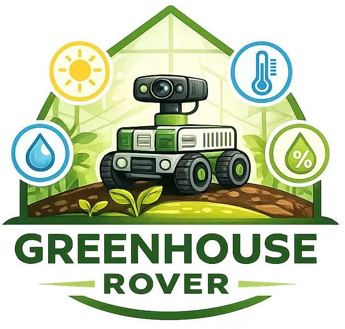
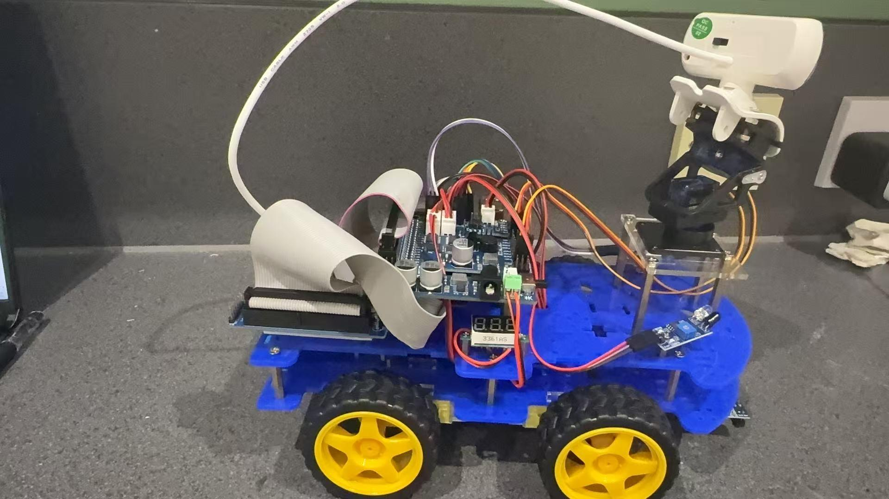
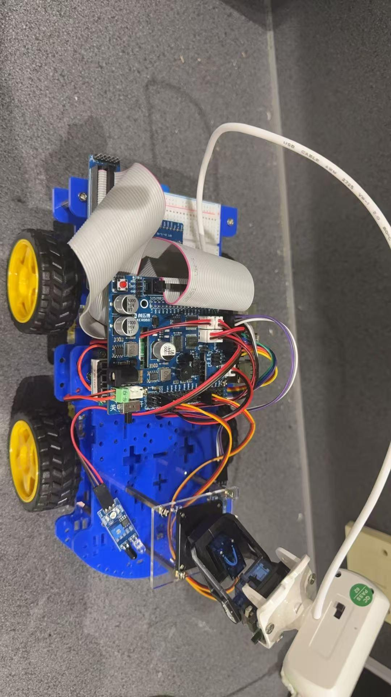

# Greenhouse Inspection Rover - "Measure. Monitor. Grow"

  

This GitHub repository showcases a real-time embedded systems project focused on greenhouse inspection and environmental monitoring. The rover measures temperature, humidity, and light intensity at multiple points in the greenhouse, while an onboard camera captures images of plant growth for visual inspection and historical comparison.

The rover supports manual control and scheduled patrols, and stores data locally with timestamps. When abnormal conditions are detected, the system can trigger alerts and optionally capture additional close-up photos. The goal is to help greenhouse operators identify issues early, reduce manual workload, and improve crop consistency.

  

  

  <em>Figure 1. Rover Prototype (Photo): Side view of the greenhouse inspection rover.</em> 
  <em>Figure 2. Rover Top View (Photo): Top view showing controller board, wiring, and sensor layout.</em>

## Key Objectives

- **Environmental Monitoring:** Measure temperature, humidity, and light at different greenhouse locations.
- **Visual Inspection:** Capture plant images for routine checks and growth tracking.
- **Early Warning:** Detect abnormal conditions and generate alerts.
- **Data Logging & Traceability:** Store sensor readings and images with timestamps.
- **Safe Operation:** Support reliable movement, obstacle handling, and fail-safe stop.
- **Ease of Use:** Provide a simple workflow from patrol to report export.

## System Photos / CAD Renders

This section presents the visual documentation of the rover, including real prototype photos and CAD renders. The figures help reviewers understand the mechanical structure, sensor placement, and overall system layout.

Recommended figures to include:

- **Figure 1 – Full Rover Prototype (Photo):** Overall view of the rover in a greenhouse aisle.
- **Figure 2 – Electronics Bay (Photo/CAD):** Raspberry Pi, motor driver, power regulation, and wiring layout.

## Table of Contents

- [Bill of Materials (BOM)](#bill-of-materials-bom)
- [System Functional Requirements](#system-functional-requirements)
- [Extended Features](#extended-features)
- [User Workflow and Operating Modes](#user-workflow-and-operating-modes)
- [Software Architecture](#software-architecture)
- [Repository Structure and Key Classes / Modules](#repository-structure-and-key-classes--modules)
- [User Case UML / Sequence Diagram](#user-case-uml--sequence-diagram)
- [Circuit / Wiring Diagram](#circuit--wiring-diagram)
- [Data Logging, Alerts and Reporting](#data-logging-alerts-and-reporting)
- [Latency and Performance Notes](#latency-and-performance-notes)
- [Validation and Test Plan](#validation-and-test-plan)
- [Risk Assessment and Safety Features](#risk-assessment-and-safety-features)
- [Acknowledgements](#acknowledgements)
- [Authors and Contributions](#authors-and-contributions)
- [License (Third-Party Libraries)](#license-third-party-libraries)
- [Future Work](#future-work)
- [Contact Us](#contact-us)
- [Last Updated](#last-updated)

## Bill of Materials (BOM)

### Controller

The greenhouse inspection rover uses a Raspberry Pi 4 Model B as the main controller. The Pi handles sensor acquisition, camera capture, patrol logic, and data logging.

**Controller BOM (Raspberry Pi 4B):**

- Raspberry Pi 4 Model B (4GB recommended) ×1  
- microSD Card (32–64GB, Class 10 / U3) ×1  
- 5V Buck Converter (≥3A recommended) ×1  
- Power Switch + Inline Fuse ×1  
- GPIO Breakout / Screw Terminal HAT (optional) ×1  
- Cooling (heatsinks + fan, recommended) ×1 set  

**Notes:** Use a common ground between the Pi, motor driver, and sensors. Separate motor power and logic power rails where possible.

### Sensors

*(Insert sensor BOM table here: temperature/humidity sensor, light sensor, camera, obstacle sensor, etc.)*

### Mobility & Supporting Components

*(Insert mobility and support BOM table here: chassis, motors, motor driver, battery pack, wiring, brackets, etc.)*

### Grand Total

*(Insert BOM total cost here.)*

## System Functional Requirements

The greenhouse inspection rover shall support routine patrol, data collection, and operator review.

### Environmental Sensing
- Measure temperature, humidity, and light at configurable intervals.
- Support basic filtering and calibration offsets.
- Detect invalid readings and log faults.

### Visual Inspection (Camera)
- Capture still images at configurable intervals.
- Support event-triggered image capture.
- Allow manual photo capture during teleoperation.

### Patrol and Movement
- Provide manual control mode for testing and targeted inspection.
- Provide patrol mode with checkpoints and sampling stops.
- Support basic obstacle stop/wait behavior.

### Data Logging and Reporting
- Log sensor readings and mission metadata locally.
- Store images with consistent naming.
- Generate a mission summary at the end of patrol.

### Alerts and Thresholds
- Support threshold-based alerts.
- Support simple trend-based alerts.
- Record alert events with timestamps.

### Safety and Fail-Safe Behavior
- Include emergency stop capability.
- Stop motors on critical faults.
- Monitor battery level and support low-battery warning.

### Usability
- Provide a simple operator workflow.
- Provide clear status indication (running / alert / error).

## Extended Features

The following features extend the rover toward a more complete smart agriculture platform.

### Multi-Point Patrol & Location Tagging
- Route-based patrol with checkpoints.
- Time-based or distance-based sampling.
- Location tags for each measurement.

### Smart Alerts and Event Handling
- Threshold alerts for key parameters.
- Trend alerts for continuous rise/fall.
- Event actions such as pause and close-up photo capture.

### Plant Growth Tracking with Vision (Optional)
- Scheduled photo capture at fixed locations.
- Simple visual comparison over time.
- Optional rule-based image indicators.

### Closed-Loop Environmental Actuation (Optional)
- Relay control for fan, humidifier, or supplemental lighting.
- Basic rule-based actuation (if–then logic).

### Remote Dashboard & Operator Interface
- Local web dashboard on Raspberry Pi.
- Real-time values, alerts, mission status, and image gallery.
- Start/stop patrol and manual capture controls.

### Reliability and Safety Enhancements
- Battery monitoring and safe-stop behavior.
- Watchdog and fail-safe stop.
- Obstacle detection and stop/reroute logic.

## User Workflow and Operating Modes

This section describes how operators use the rover and how the rover behaves under different modes.

### Typical User Workflow
1. Power on and perform system check.
2. Select operating mode.
3. Start mission (manual or patrol).
4. Monitor sensor values and alerts.
5. Handle events (pause / extra photos if needed).
6. End mission and stop rover.
7. Review and export logs/images.

### Operating Modes
- **Mode A — Manual Inspection:** Teleoperation for targeted checks and manual photo capture.
- **Mode B — Patrol Mission:** Route-based inspection with automatic sampling and logging.
- **Mode C — Stationary Monitoring (Optional):** Fixed-point sensing and periodic photo capture.
- **Mode D — Data Review / Maintenance:** View logs, manage storage, and run diagnostics.

### State Machine (Recommended)
- **Idle → Self-check → Manual / Patrol / Stationary → Alert-handling → Return / Stop → Report**
- Critical faults shall trigger **Safe Stop**.

## Software Architecture

The greenhouse inspection rover software follows a modular architecture for reliability, testing, and future scalability.

### High-Level Architecture
Core modules include:
- Mission Manager (FSM)
- Sensor Manager
- Vision Module
- Motion Control Module
- Navigation Module
- Alert Manager
- Data Logger
- UI / Dashboard

### Data Flow
1. Sensors produce readings.
2. Sensor Manager filters and timestamps data.
3. Data is sent to Logger and Alert Manager.
4. Alerts may trigger event actions (e.g., extra photo capture).
5. Images and logs are stored and summarized after mission end.

### Concurrency Model (Recommended)
- Sensor sampling task
- Motion/navigation control task
- Camera capture task
- UI/communication task

### Key Design Principles
- Loose coupling between modules
- Fail-safe first
- Configuration-driven settings
- Testability with stubs/simulated inputs

## Repository Structure and Key Classes / Modules

*(Insert repository tree and short module descriptions here.)*

## User Case UML / Sequence Diagram

This section describes the main user cases and subsystem interactions.

### Main User Cases
- **Start Patrol Mission**
- **Manual Inspection & Photo Capture**
- **Alert Event Handling**
- **End Mission & Export Report**

### Sequence Diagram — Patrol Mission
Insert Figure: **“Sequence Diagram — Patrol Mission”** (UML sequence diagram).

## Circuit / Wiring Diagram

Insert Figure: **Circuit / Wiring Diagram** (Raspberry Pi, sensors, motor driver, camera, power system).

## Data Logging, Alerts and Reporting

This section describes how sensor data, alerts, and images are stored and summarized.

- Sensor readings logged with timestamps
- Images stored with mission/event tags
- Alerts recorded with parameter values
- Mission summary generated after patrol

## Latency and Performance Notes

This section summarizes timing and performance notes for sensing, movement, and image capture.

- Sensor sampling interval and response time
- Motion control loop timing
- Camera capture delay and storage latency
- Notes on system responsiveness during patrol

## Validation and Test Plan

This section outlines the validation plan for the rover.

- Sensor reading validation
- Camera capture test
- Patrol and obstacle stop test
- Alert triggering test
- Data logging and export test
- End-to-end mission test

## Risk Assessment and Safety Features

This section identifies key project risks and safety mitigations.

- Power and battery safety
- Motor fault / runaway prevention
- Sensor failure handling
- Emergency stop behavior
- Wiring and enclosure safety

## Acknowledgements

We would like to thank our supervisors, lab staff, and workshop technicians for their support in the design, testing, and integration of this project.

## Authors and Contributions

*(Insert team member names and contributions here.)*

## License (Third-Party Libraries)

*(List third-party libraries, drivers, and licenses used in this project.)*

## Future Work

Future improvements may include more advanced navigation, automated return-to-home, improved vision-based plant analysis, and integration with greenhouse control devices.

## Contact Us

*(Insert project contact email here.)*

## Last Updated

This README was last updated on **[DD/MM/YYYY]**.

