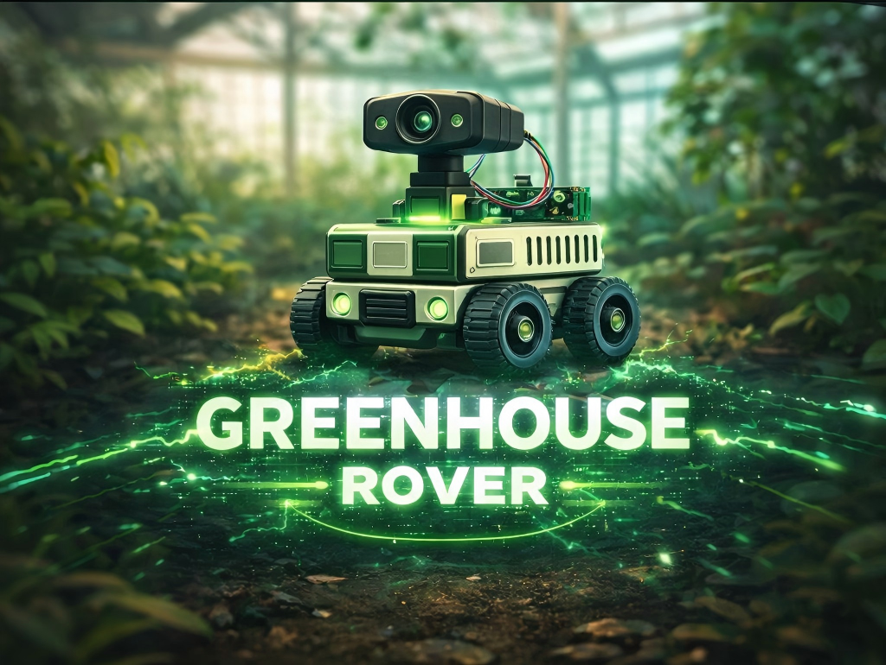
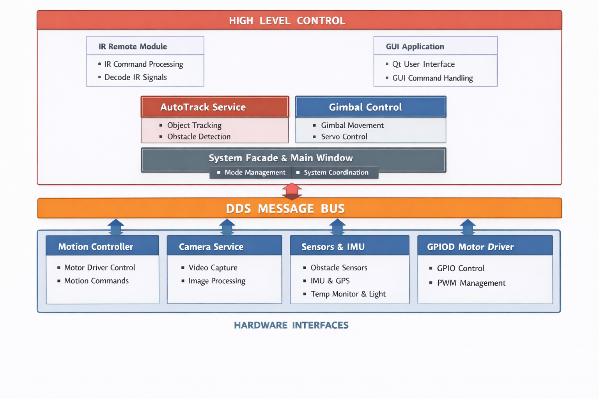
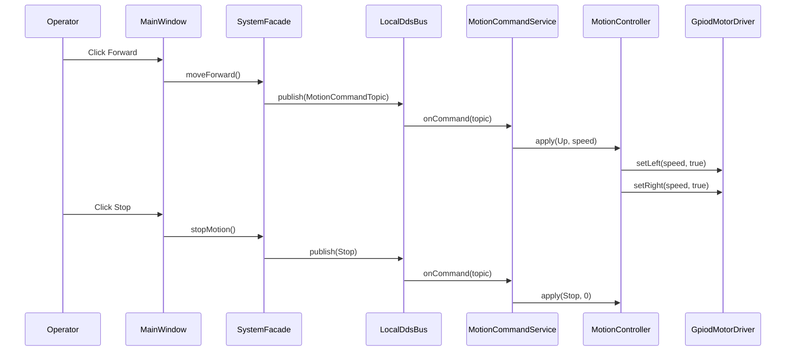
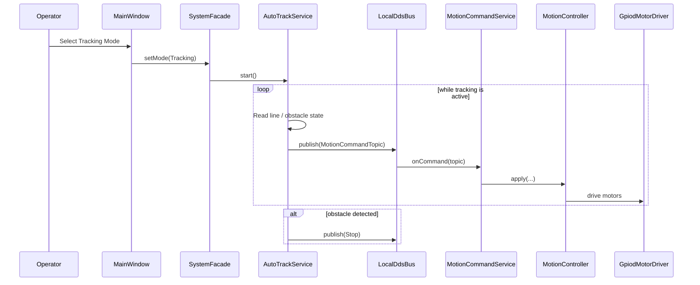
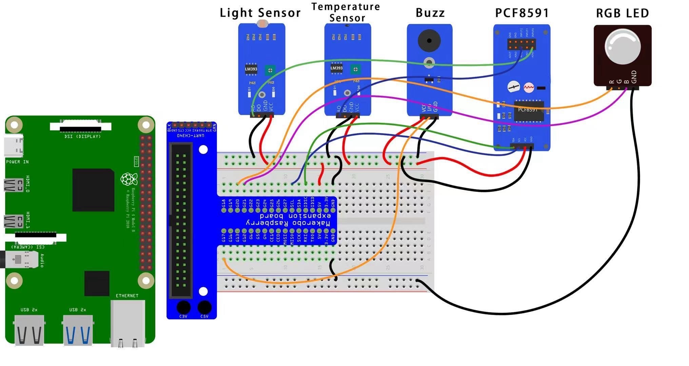
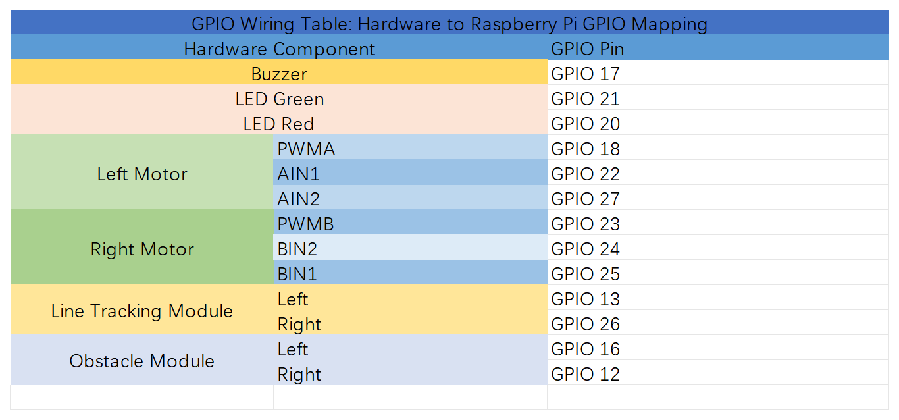

# A Non-Contact Intelligent Inspection and Micro-Environment Intervention Platform for Strawberry Greenhouses

<p align="center">
  
</p>

---

## Overview

This project presents a **non-contact intelligent inspection and micro-environment intervention platform for strawberry greenhouses**. It integrates mobility, environmental sensing, visual inspection, local alerting, desktop visualization, and operator takeover into a unified system.

The platform is designed to support continuous monitoring of strawberry maturity, leaf health, and local environmental abnormalities inside greenhouse environments. By reducing repetitive manual inspection, lowering the risk of contact damage to delicate crops, and providing more traceable data for decision-making, the system aims to make greenhouse inspection more structured, efficient, and practical.

Rather than presenting the system as a fully autonomous replacement for greenhouse labor, this project explores how a low-cost robotic platform can restructure routine inspection into a more repeatable, traceable, and data-supported workflow.

## Background and Motivation

Strawberry cultivation is highly sensitive to environmental conditions and crop status. In greenhouse production, changes in temperature, light, humidity, and plant health can directly affect fruit quality, ripening progress, and final yield. However, traditional inspection still relies heavily on manual patrol. Growers or operators must walk through greenhouse aisles, check fruit maturity, observe whether leaves show yellowing or dark spots, and identify local environmental abnormalities based on experience.

This traditional approach has several limitations. First, it is labor-intensive and time-consuming. Second, manual inspection is difficult to standardize and depends strongly on individual experience. Third, strawberries are delicate crops: close inspection, touching, or moving leaves and fruits can easily cause bruising, contamination, or accidental damage, which directly affects product quality.

To address these practical problems in strawberry greenhouse scenarios, this project was developed as an integrated inspection platform rather than a simple sensor-equipped smart car. The system combines **automatic line-following patrol and obstacle avoidance** for routine movement, **temperature sensing and threshold-based feedback** for local environmental judgment, **OpenCV-based fruit and leaf inspection** for non-contact crop observation, **buzzer and LED alerts** for local warning, **GUI-based desktop visualization** for system monitoring, and **infrared remote control with pan-tilt adjustment** for manual takeover and close-up review.

This design reflects a key observation: greenhouse problems are often **local rather than uniform**. One area may be slightly hotter, another may receive insufficient light, a few plants may show leaf abnormalities, and fruit in one row may ripen faster than those in another. Fixed observation points and occasional manual checks are often not detailed or continuous enough to capture these differences. A mobile platform, by contrast, can move across the greenhouse, observe local variations, and generate image and sensor records with greater consistency.

From this perspective, the value of the project lies not in any single function, but in how multiple functions operate together as one inspection workflow. The system is not only a moving platform, but also a prototype that connects **mobile inspection, environmental sensing, visual recognition, abnormal warning, human review, and data visualization**. Its purpose is to reduce repetitive manual work, lower contact-related crop damage, and support earlier and more data-supported intervention in greenhouse management.

In short, this project addresses a practical question: **Can a lightweight, mobile, and expandable platform replace part of the traditional high-frequency manual inspection process without increasing crop-damage risk?** This project is our answer to that question.

## Application Value

The significance of this platform lies in its ability to transform greenhouse inspection from a largely experience-based manual activity into a more structured workflow built on patrol, sensing, image capture, warning, and review.

- It reduces repetitive manual greenhouse patrol.
- It lowers the risk of damaging delicate strawberry fruits and leaves during inspection.
- It improves the ability to detect local environmental abnormalities and crop-status changes earlier.
- It supports non-contact inspection through image-based fruit and leaf observation.
- It combines automatic patrol with human takeover, making the system practical rather than purely demonstrational.
- It creates timestamped, reviewable inspection records through sensor logging, image capture, and GUI-based visualization.

More broadly, the project proposes a new inspection model for strawberry greenhouse management: **automatic patrol as the primary process, manual review for suspicious cases, and data records to support decisions**. In this sense, the platform is not just a prototype vehicle, but a practical smart-agriculture inspection concept.

---

## Key Objectives

- **Non-Contact Crop Inspection:** Inspect strawberry fruits and leaves without direct contact, reducing the risk of bruising, contamination, or accidental damage.
- **Mobile Greenhouse Patrol:** Perform routine patrol along greenhouse aisles through automatic line-following and basic obstacle avoidance.
- **Micro-Environment Monitoring:** Measure local environmental conditions, especially temperature, and identify abnormal zones through configurable threshold logic.
- **Visual Recognition:** Use OpenCV-based methods to detect fruit maturity and leaf-color abnormalities for preliminary crop-status assessment.
- **Local Warning and Human Review:** Provide buzzer and LED alerts for abnormal conditions and support manual takeover through infrared remote control and pan-tilt camera adjustment.
- **Visualization and Traceability:** Present system status, environmental data, and inspection results through a GUI, enabling more traceable and data-supported greenhouse management.

---

## System Photos / CAD Renders

This section presents visual documentation of the platform, including real prototype photos. These figures help reviewers understand the mechanical structure, sensor placement, wiring layout, and overall system arrangement.

<p align="center">
  <br>
  <em>Figure 1. Prototype side view of the greenhouse inspection platform.</em>
</p>

<p align="center">
  <br>
  <em>Figure 2. Top view showing the controller board, wiring, and sensor layout.</em>
</p>

<p align="center">
  <br>
  <em>Figure 3. Additional structural view of the prototype platform.</em>
</p>

---

## Table of Contents

- [Main Libraries and Dependencies](#main-libraries-and-dependencies)
- [Module-Level Libraries and Dependencies](#module-level-libraries-and-dependencies)
- [Bill of Materials (BOM)](#bill-of-materials-bom)
- [System Functions](#system-functions)
- [User Workflow and Operating Modes](#user-workflow-and-operating-modes)
- [Software Architecture](#software-architecture)
- [Repository Structure and Key Classes / Modules](#repository-structure-and-key-classes--modules)
- [Build and Run](#build-and-run)
- [User Case UML / Sequence Diagram](#user-case-uml--sequence-diagram)
- [Circuit / Wiring Diagram](#circuit--wiring-diagram)
- [Last Updated](#last-updated)

---

## Main Libraries and Dependencies

This project is implemented in C++ and relies on the following main libraries, frameworks, and system interfaces:

- **libgpiod v2**  
  Used for GPIO access and hardware control on Raspberry Pi, including motor control, buzzer output, LED indicators, line-tracking sensors, and obstacle-detection sensors.

- **Qt5 (Widgets / Core / Gui)**  
  Used to build the desktop GUI for system monitoring, status display, control interaction, camera-frame rendering, and visualization of inspection results.

- **OpenCV**  
  Used for camera capture, image preprocessing, HSV color-space conversion, fruit detection, leaf detection, color-based analysis, contour extraction, annotation drawing, preview display, and image conversion for the GUI.

- **LIRC (`lirc_client`)**  
  Used for infrared remote-control input, including IR receiver initialization, remote-code decoding, and command mapping for vehicle motion and pan-tilt control.

- **Linux i2c-dev interface**  
  Used for communication with the PCA9685 PWM controller that drives the pan-tilt gimbal servos over I2C.

- **C++ Standard Library**  
  Used throughout the project for multithreading, synchronization, callbacks, timing, containers, sorting, numeric processing, and general application logic.

- **POSIX / Linux system calls and interfaces**  
  Used for low-level system tasks such as directory creation, file-descriptor control, `epoll`, `eventfd`, `timerfd`, `read`, `write`, `close`, `ioctl`, and thread-safe event handling on Linux.

---

## Module-Level Libraries and Dependencies

### Camera / Vision Module

The camera subsystem is implemented as a dedicated C++ service (`CameraService`) for real-time image acquisition, target detection, preview display, and event-based image saving.

**Libraries and interfaces used**
- **OpenCV**  
  Used for camera input (`cv::VideoCapture`), frame preprocessing, HSV masking, morphology operations, contour extraction, fruit detection, leaf detection, annotation drawing, preview display, and image saving.
- **C++ Standard Library**  
  Used for multithreading, synchronization, callbacks, containers, timing control, sorting, and detection-result publishing.
- **POSIX / Linux system calls**  
  Used for checking and creating the local image-save directory.

### Infrared Remote Module

The infrared remote module is implemented as a dedicated C++ service (`IrRemote`) for decoding remote-control input and publishing typed commands to the internal DDS-style message bus.

**Libraries and interfaces used**
- **LIRC (`lirc_client`)**  
  Used for infrared receiver initialization, remote configuration loading, code reading, and cleanup.
- **POSIX / Linux system interfaces**  
  Used for `epoll`, `eventfd`, `read`, `write`, and `close` to implement blocking, event-driven IR listening and controlled thread shutdown.
- **C++ Standard Library**  
  Used for threading, atomic state control, callback handling, and debounce timing.
- **LocalDdsBus / VehicleTopics**  
  Used as the project’s internal DDS-style communication layer so that the IR module publishes typed motion and gimbal commands without directly controlling the hardware.

### Motor Control Module

The motor-control subsystem is implemented as a differential-drive driver based on **libgpiod v2**. It controls the left and right motors independently and generates software PWM through a dedicated worker thread.

**Libraries and interfaces used**
- **libgpiod v2**  
  Used for Raspberry Pi GPIO line access, output-line configuration, and setting motor direction and PWM pin states.
- **POSIX / Linux system interfaces**  
  Used for `epoll`, `eventfd`, `timerfd`, `read`, `write`, and `close` to implement event-driven software PWM without busy waiting.
- **C++ Standard Library**  
  Used for threading, atomic state control, mutex protection, speed clamping, fixed-size arrays, and runtime error handling.
- **IMotorDriver interface**  
  Used as an internal abstraction layer so that the motor driver implementation can be replaced or extended more easily in the future.

### Qt GUI Module

The desktop control interface is implemented with **Qt5** and provides a user-friendly panel for camera preview, vehicle motion control, gimbal control, and temperature monitoring.

**Libraries and frameworks used**
- **Qt5 Widgets**  
  Used to build the main window and interactive controls, including buttons, labels, spin boxes, layouts, and group boxes.
- **Qt5 Core**  
  Used for the signal-slot mechanism, timers, and string handling in the GUI event loop.
- **Qt5 Gui**  
  Used for image display components such as `QImage` and `QPixmap`.
- **OpenCV**  
  Used together with Qt to convert `cv::Mat` camera frames into displayable GUI images.
- **C++ Standard Library**  
  Used for time durations, strings, and general application logic inside the façade layer.
- **LocalDdsBus / VehicleTopics / SystemFacade**  
  Used as the internal coordination layer so that the GUI publishes typed commands instead of directly controlling low-level hardware.

### Gimbal Module

The pan-tilt gimbal subsystem is implemented as a dedicated servo-control service based on a **PCA9685 PWM driver over Linux I2C**. It receives typed commands through the internal DDS-style bus and converts them into pan/tilt servo movements.

**Libraries and interfaces used**
- **Linux i2c-dev interface**  
  Used for low-level communication with the PCA9685 servo controller through `/dev/i2c-1`.
- **POSIX / Linux system interfaces**  
  Used for `open`, `read`, `write`, `close`, `ioctl`, and `usleep` during I2C device access and PWM-controller configuration.
- **C++ Standard Library**  
  Used for mutex-based synchronization, I2C payload construction, numeric calculations, state management, and runtime error handling.
- **LocalDdsBus / VehicleTopics**  
  Used as the internal DDS-style communication layer so that gimbal commands from the GUI and IR remote module can be handled in a unified way.

**Hardware notes**
- **PWM controller:** PCA9685  
- **I2C device:** `/dev/i2c-1`  
- **Default I2C address:** `0x40`  
- **Servo channels:** tilt = channel 0, pan = channel 1

---

## Bill of Materials (BOM)

This section lists the main hardware modules used to implement the non-contact strawberry greenhouse inspection platform, including mobility, sensing, warning, visual inspection, and operator-control functions.

#### **Raspberry Pi 4 Model B (4GB recommended)**

Acts as the main controller for sensing, image capture, logging, GUI interaction, and higher-level task coordination.

#### **Motor Expansion Board**

Provides motor-driving capability for platform movement and low-level motion control.

#### **Sensor Kit**

Includes environmental sensing and auxiliary modules used for routine inspection tasks.

#### **Analog Temperature Sensor Module**

Used for local temperature measurement and threshold-based monitoring.

#### **PCF8591 ADC/DAC Module**

Provides analog-to-digital conversion for analog sensor input and enables flexible sensor integration.

#### **Active Buzzer**

Used for audible alerts during abnormal conditions or fault events.

#### **RGB LED Module**

Provides simple visual state indication such as normal, warning, or fault status.

#### **T-Type GPIO Expansion Board (T-Cobbler)**

Simplifies prototyping and wiring between the Raspberry Pi and peripheral modules.

#### **IR Line Tracking Module**

Supports basic line-following behavior for structured patrol paths.

#### **IR Receiver + IR Remote Controller**

Enables remote manual control for targeted inspection and testing.

#### **USB Camera + Pan-Tilt Servo Gimbal**

Provides visual inspection capability and adjustable camera orientation for targeted observation. Basic color-based visual analysis is used for fruit and leaf inspection tasks.

#### **Breadboard**

Used for temporary wiring, testing, and modular integration during development.

#### **Voltmeter Module**

Used for battery or power monitoring to support low-voltage warning and safer operation.

---

## System Functions

The Raspberry Pi smart car platform implements a local inspection and control system for greenhouse-style strawberry monitoring tasks. Based on the current codebase, the system already supports manual control, automatic line-tracking, camera-based visual inspection, onboard temperature monitoring, local warning indication, and a Qt-based user interface.

### Software Architecture

<p align="center">
  
  <br>
  <em>Figure 5. Layered software architecture of the current implemented system.</em>
</p>

The software is organized as a layered architecture built around a DDS-style publish/subscribe control path. At the top level, the operator interacts with the platform through the Qt GUI and infrared remote control. In the middle layer, motion and gimbal commands flow through the internal DDS-style message bus. At the lower layer, runtime services access the camera, gimbal, motor driver, line sensors, obstacle sensors, and temperature-monitoring hardware.

### Control and Operator Interface

- The system provides a Qt-based graphical user interface for live operation.
- The GUI supports:
  - motion control: forward, backward, left, right, and stop
  - gimbal control: up, down, left, right, and reset
  - mode switching between **Manual Mode** and **Tracking Mode**
  - live camera display
  - current temperature display
  - current monitoring status display
  - editable lower and upper temperature thresholds
- The system also supports infrared remote control for motion and gimbal commands during manual operation.

### Motion and Vehicle Control

- The system supports the basic motion primitives:
  - forward
  - backward
  - left turn
  - right turn
  - stop
- Motion commands are published through a shared DDS-style command path.
- A motion command service receives and executes the commands with duration control.
- The motion controller converts high-level motion commands into left and right motor actions.
- The GPIO motor driver performs low-level motor actuation using direction control and software PWM.

### Gimbal Control

- The system supports pan-tilt camera control through a PCA9685-based servo driver.
- The implemented gimbal functions include:
  - tilt up
  - tilt down
  - pan left
  - pan right
  - reset to center
- Gimbal commands can be issued from both the GUI and the IR remote.
- The gimbal is also used by the auto-tracking subsystem for centering and sweep behavior.

### Automatic Tracking Function

- The system provides an automatic tracking mode based on line sensors and obstacle sensors.
- In tracking mode:
  - the vehicle moves forward when the path is correctly detected
  - the vehicle steers left or right according to line-sensor states
  - the vehicle stops when the line is lost
- If an obstacle is detected:
  - the vehicle immediately stops
  - tracking motion is suspended until the obstacle condition is cleared
  - the gimbal is returned toward the center position
- The auto-tracking service runs independently from manual teleoperation and is coordinated by the system facade.

#### Table 1. Auto-tracking decision rules

| Condition | System action | Purpose |
|---|---|---|
| Left = 0, Right = 0 | Publish **Forward** motion command | Move along the detected path |
| Left = 1, Right = 0 | Publish **Left Turn** motion command | Correct heading to the left |
| Left = 0, Right = 1 | Publish **Right Turn** motion command | Correct heading to the right |
| Left = 1, Right = 1 | Publish **Stop** command | Stop when the track is lost |
| Obstacle detected | Publish **Stop** command immediately | Prevent collision |
| Obstacle cleared | Resume line-based decision logic | Continue auto-tracking |
| Obstacle active during tracking | Return gimbal toward center position | Keep the camera in a safe neutral orientation |
| Tracking mode enabled | Run sensor, obstacle, and gimbal worker loops | Support continuous autonomous behavior |

### Camera and Visual Inspection

- The system captures live frames from the onboard camera.
- The camera service performs rule-based image processing using OpenCV.
- The implemented visual functions include:
  - fruit detection using HSV color segmentation and contour filtering
  - leaf detection using contour extraction
  - leaf-condition screening based on color-ratio analysis
- Leaves are classified into:
  - **Normal**
  - **Suspicious**
  - **Abnormal**
- The processed frame is annotated and displayed in the GUI for operator review.
- The system saves captured inspection images locally when significant detection results are present, such as fruit targets or abnormal leaves.

### Environmental Monitoring and Warning

- The system currently implements **temperature monitoring** using an NTC sensor through the PCF8591 ADC.
- The monitoring service reads and filters temperature samples before updating the runtime state.
- The operator can set lower and upper temperature thresholds from the GUI.
- The system provides local warning outputs through:
  - LEDs
  - buzzer
- The GUI shows both the current temperature and the current monitoring status in real time.

#### Table 2. Temperature monitoring and local alert behavior

| Runtime condition | Temperature status | LED behavior | Buzzer behavior | GUI update |
|---|---|---|---|---|
| Reading valid and below lower threshold | **Too Cold** | Alert indication enabled | Alert indication enabled | Show low-temperature warning status |
| Reading valid and within threshold range | **Normal** | Normal-state indication | No warning tone | Show normal status |
| Reading valid and above upper threshold | **Too Hot** | Alert indication enabled | Alert indication enabled | Show high-temperature warning status |
| Reading invalid but previous valid state exists | Retry / keep last valid interpretation | Preserve safe runtime behavior | No new abnormal trigger unless condition confirmed | Show retry or temporary invalid state |
| Reading invalid and no valid reference available | Sensor invalid / unavailable | Conservative state | Conservative state | Show invalid-sensor status |
| User changes low / high limits in GUI | Thresholds updated | Future evaluations use new limits | Future evaluations use new limits | GUI reflects new thresholds immediately |

### System Coordination

- The main runtime is coordinated through `SystemFacade`.
- This layer is responsible for starting, stopping, and switching between the major subsystems:
  - motion service
  - gimbal service
  - monitor service
  - camera service
  - IR service
  - auto-tracking service
- The project provides both:
  - a command-line runtime entry
  - a Qt GUI entry

### Implemented Scope in the Current Version

The current version already implements the following practical system functions:

- manual teleoperation
- infrared remote control
- GUI-based operation
- line-following style automatic tracking
- obstacle-triggered stop behavior
- motor actuation through GPIO
- pan-tilt gimbal control
- camera-based fruit detection
- camera-based leaf abnormality screening
- temperature monitoring
- local LED and buzzer warning
- local image capture and storage

### Functions Not Yet Implemented in the Current Codebase

The following ideas are useful future extensions, but they are not fully implemented in the current code version:

| Planned capability | Current status |
|---|---|
| Humidity sensing | Not yet implemented |
| Light sensing | Not yet implemented |
| Structured multi-point patrol with checkpoint tagging | Not yet implemented |
| CSV / SQLite mission logging | Not yet implemented |
| Automatic mission summary generation | Not yet implemented |
| Low-battery monitoring | Not yet implemented |
| Remote web dashboard | Not yet implemented |
| Closed-loop environmental actuation | Not yet implemented |
| Reroute logic after obstacle detection | Not yet implemented |

---

## User Workflow and Operating Modes

This section describes how an operator interacts with the current implemented system. Based on the present codebase, the platform supports two practical operating modes: **Manual Mode** and **Tracking Mode**.

### Typical User Workflow

1. **Power On**  
   Start the command-line runtime or launch the Qt GUI application.

2. **System Initialization**  
   The platform initializes the gimbal, motion service, monitor service, camera service, and control interface.

3. **Select Mode**  
   The operator selects either **Manual Mode** or **Tracking Mode** from the GUI.

4. **Operate the Platform**
   - In **Manual Mode**, the operator uses GUI buttons or the IR remote to control motion and gimbal movement.
   - In **Tracking Mode**, the platform uses line sensors and obstacle sensors to perform automatic line-following style movement.

5. **Monitor Status**  
   The operator observes the live camera view, current temperature, and current system status from the GUI.

6. **Stop or Switch Mode**  
   The operator can stop the vehicle at any time or switch between Manual and Tracking modes.

### Operating Modes

- **Manual Mode**
  - GUI motion buttons enabled
  - GUI gimbal buttons enabled
  - IR remote enabled
  - Intended for direct teleoperation, debugging, and close-up inspection

- **Tracking Mode**
  - AutoTrackService enabled
  - IR remote disabled
  - Manual motion buttons disabled
  - Intended for line-following style autonomous movement with obstacle stop behavior

---

## Software Architecture

The current software architecture is centered on a small number of implemented runtime services rather than a full mission-management stack. The design emphasizes modular coordination through typed commands and service boundaries.

### Current Runtime Modules

- **MainWindow**  
  Provides the desktop GUI for mode selection, motion control, gimbal control, camera preview, and temperature display.

- **SystemFacade**  
  Acts as the coordination layer that starts/stops services and switches between Manual and Tracking modes.

- **IrRemote**  
  Decodes infrared remote-control input and publishes motion/gimbal-related commands.

- **MotionCommandService**  
  Subscribes to motion commands from the DDS-style bus and applies them with timing control.

- **MotionController**  
  Maps motion primitives to left/right differential-drive actions.

- **GpiodMotorDriver**  
  Performs low-level GPIO motor driving and software PWM generation.

- **CameraService**  
  Captures frames, performs fruit/leaf inspection, annotates frames, and saves relevant images.

- **MonitorService**  
  Monitors temperature and drives LED/buzzer alerts according to threshold logic.

- **AutoTrackService**  
  Implements line-following style autonomous movement and obstacle-triggered stop behavior.

- **Gimbal control path**  
  Handles pan-tilt camera control through a PCA9685-based driver over Linux I2C.

#### Table 3. Implemented runtime modules and responsibilities

| Module / Class | Main responsibility | Input | Output / Effect |
|---|---|---|---|
| `MainWindow` | Provide the Qt GUI for live operation | User button clicks, mode selection | GUI commands, camera preview, temperature/status display |
| `SystemFacade` | Coordinate runtime services and mode switching | GUI mode/control requests | Starts/stops services and publishes typed commands |
| `IrRemote` | Decode IR remote input | Remote-control key events | Motion or gimbal command topics |
| `MotionCommandService` | Execute motion commands from the DDS-style bus | `MotionCommandTopic` | Timed motion application |
| `MotionController` | Map motion primitives to differential-drive behavior | Forward / backward / left / right / stop | Left/right motor actions |
| `GpiodMotorDriver` | Drive motors through GPIO and software PWM | Motor direction and speed requests | Physical wheel actuation |
| `GimbalService` | Control pan-tilt servos through PCA9685 | Gimbal commands | Pan / tilt / reset movement |
| `CameraService` | Capture frames and run fruit/leaf inspection | Live camera frames | Annotated frame, detections, saved images |
| `MonitorService` | Monitor temperature and generate local alerts | NTC temperature readings | GUI status update, LED control, buzzer control |
| `AutoTrackService` | Perform line-following style autonomous control | Line-sensor and obstacle-sensor states | Published motion commands for tracking mode |

### Current Data / Command Flow

- GUI buttons and IR remote input generate typed control commands.
- Commands are published through the internal DDS-style message bus.
- Motion-related commands are consumed by the motion command service.
- The motion controller and GPIO driver convert high-level commands into motor actions.
- Camera frames are processed independently and displayed in the GUI.
- Temperature-monitoring results are sent to the GUI and also drive local buzzer/LED warning behavior.
- In Tracking Mode, auto-tracking logic publishes motion commands according to line-sensor and obstacle-sensor states.

### Current Concurrency Characteristics

The current implementation uses multiple worker threads in the runtime services so that motor control, infrared listening, temperature monitoring, camera processing, and auto-tracking logic can run without blocking one another. This design helps prevent image processing or device I/O from interfering with movement safety and control responsiveness.

### Design Principles Reflected in the Current Codebase

- **Loose coupling:** command producers and command consumers are separated through an internal DDS-style bus.
- **Service-oriented runtime:** camera, monitoring, auto-tracking, and control paths are organized as distinct services.
- **Fail-safe movement behavior:** stop commands are explicitly supported in both manual and tracking paths.
- **Operator-in-the-loop design:** the GUI and IR remote remain central to practical inspection and manual takeover.
- **Incremental extensibility:** the current structure can be extended toward richer logging, additional sensing, and more complex autonomy in later versions.

---

## Repository Structure and Key Classes / Modules

The repository is organized around the current implemented runtime modules.

- `images/` — project images, logo, platform photos, wiring references, and architecture illustrations used in the README
- `include/` — header files and interface definitions for the main C++ modules
- `src/` — main source code for runtime services and hardware-control logic
- `tests/` — test programs for core modules
- `CMakeLists.txt` — project build configuration
- `README.md` — project overview, documentation, and system description

### Main Implemented Runtime Modules

- `src/gui/MainWindow.cpp`  
  Qt desktop interface for mode selection, motion control, gimbal control, camera preview, and temperature display

- `src/gui/SystemFacade.cpp`  
  High-level coordination layer that starts/stops services and switches between Manual and Tracking modes

- `src/ir/IrRemote.cpp`  
  Infrared remote decoding and command publishing

- `src/monitor/CameraService.cpp`  
  Camera capture, fruit detection, leaf abnormality screening, frame annotation, and image saving

- `src/monitor/MonitorService.cpp`  
  Temperature monitoring through PCF8591 + NTC, threshold evaluation, and LED/buzzer warning output

- `src/autonomy/AutoTrackService.cpp`  
  Line-following style auto-tracking and obstacle-triggered stop logic

- `src/rt/MotionCommandService.cpp`  
  DDS-style motion-command subscriber and timed motion execution

- `src/motion/MotionController.cpp`  
  Mapping from motion primitives to left/right motor actions

- `src/motor/GpiodMotorDriver.cpp`  
  Low-level GPIO motor driving and software PWM generation

- `src/gimbal/GimbalService.cpp`  
  PCA9685-based pan-tilt servo control over I2C

This structure supports modular development while remaining closely aligned with the current implemented codebase.

---

## Build and Run

This project uses **CMake** as the build system.

### Build Commands

```bash
cd smartcar
mkdir -p build && cd build
cmake ..
make -j$(nproc)
```

### Build Targets

The current project builds two runtime executables:

- `smartcar` — command-line runtime entry
- `smartcar_gui` — Qt desktop GUI entry

The codebase also includes module-level test targets for core functions such as bus communication, motion control, monitoring, gimbal control, camera processing, infrared remote handling, and GUI behavior.

#### Table 4. Build outputs and validation targets

| Target | Type | Purpose |
|---|---|---|
| `smartcar` | Executable | Command-line runtime entry |
| `smartcar_gui` | Executable | Qt desktop GUI application |
| `bus_test` | Test | Validate internal bus communication |
| `motion_test` | Test | Validate motion-control logic |
| `monitor_test` | Test | Validate monitoring behavior |
| `gimbal_test` | Test | Validate gimbal control behavior |
| `camera_test` | Test | Validate camera-processing functions |
| `ir_test` | Test | Validate infrared remote handling |
| `gui_test` | Test | Validate GUI-related behavior |

---

## User Case UML / Sequence Diagram

This section describes the implemented command paths in the current prototype rather than a future mission-management architecture.

### Sequence Diagram — Manual GUI Control



### Sequence Diagram — Tracking-Mode Command Path



---

## Circuit / Wiring Diagram

This section summarizes how sensing, control, actuation, warning modules, and camera interfaces are wired to the Raspberry Pi and motor-control hardware.

<p align="center">
  <br>
  <em>Figure 6. Overall wiring layout of the Raspberry Pi platform, PCF8591 module, light sensor, temperature sensor, buzzer, and RGB LED connections.</em>
</p>

<p align="center">
  <br>
  <em>Figure 7. GPIO wiring table: hardware-to-Raspberry Pi GPIO mapping used in the current prototype.</em>
</p>
---

## Last Updated

2026-03-31