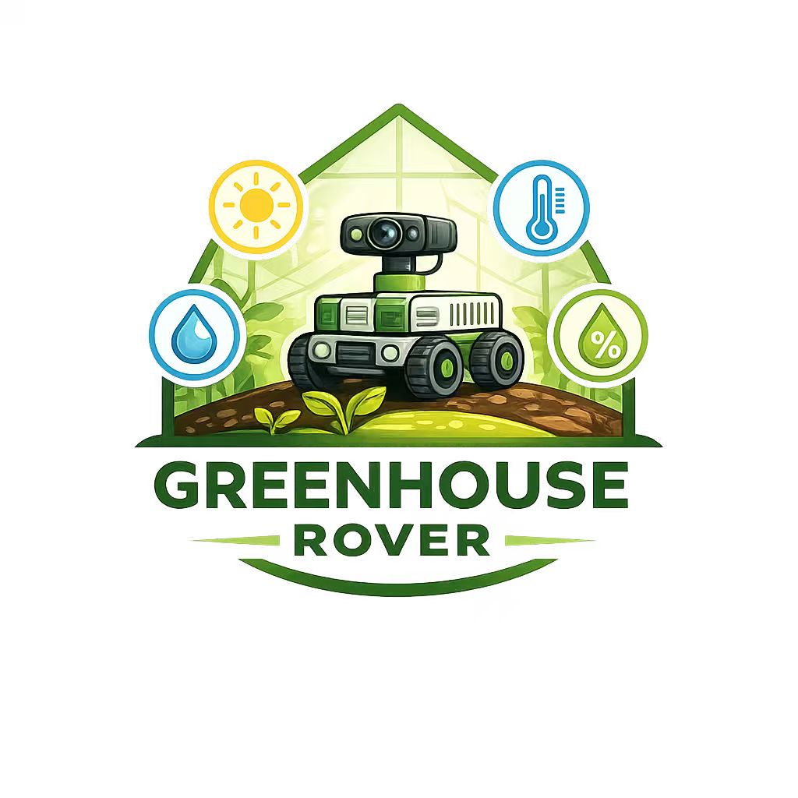
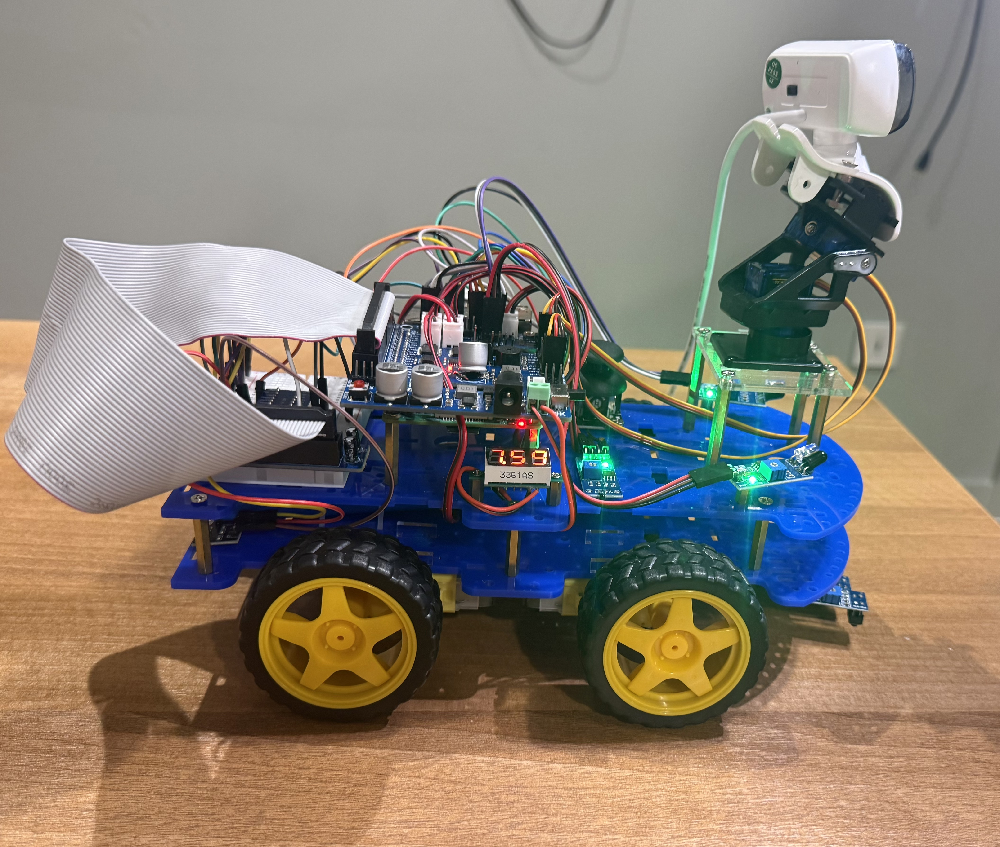
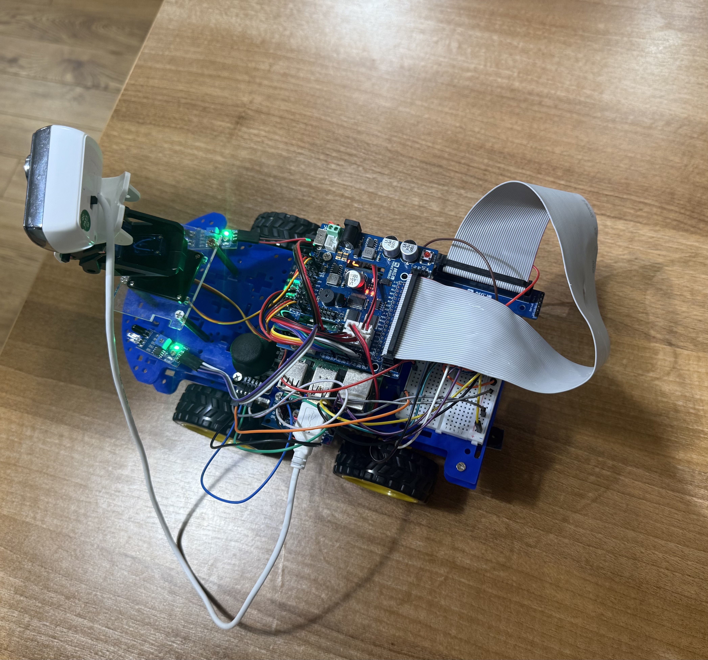
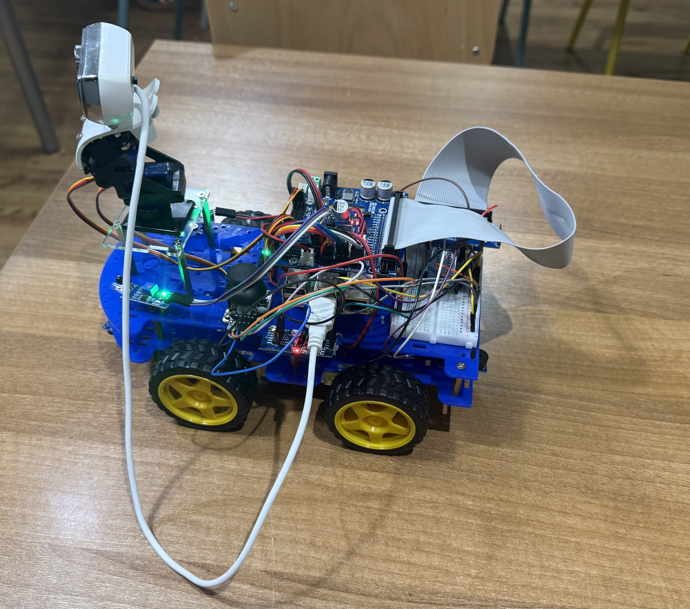
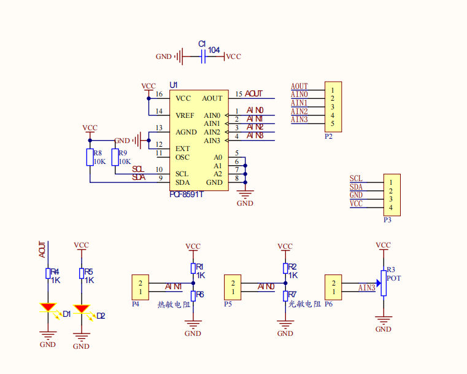
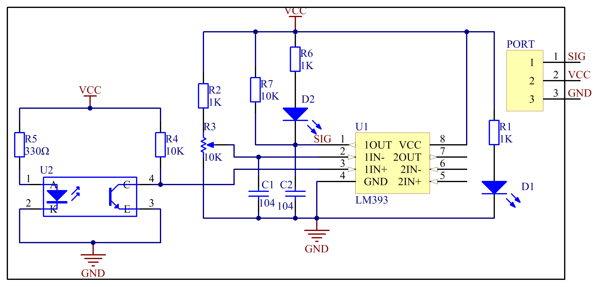

# smart-car
## Greenhouse Inspection Rover — “Measure. Monitor. Grow”

  

---

The Greenhouse Inspection Rover is a mobile monitoring platform...
The Greenhouse Inspection Rover is a mobile monitoring platform designed for routine greenhouse patrols. It measures key environmental parameters — temperature, humidity, and light intensity — at multiple points across the greenhouse, while an onboard camera captures images of plant growth for visual inspection and historical comparison.

The rover supports manual control and scheduled patrols, and stores data locally with timestamps. When abnormal conditions are detected (e.g., high temperature, low humidity, insufficient light), the system can trigger alerts and optionally take additional close-up photos at the affected area. The goal is to help greenhouse operators identify issues early, reduce manual workload, and improve crop consistency through data-driven management.

---

## Key Objectives
- **Environmental Monitoring:** Collect accurate temperature, humidity, and light measurements across different greenhouse locations.
- **Visual Inspection:** Use an onboard camera to capture plant growth images for routine checks and progress tracking.
- **Early Warning:** Detect abnormal conditions and generate alerts (threshold-based and trend-based) to support timely intervention.
- **Data Logging & Traceability:** Store sensor readings and images with timestamps (and optional location tags) for later review and reporting.
- **Safe Operation:** Ensure reliable movement in narrow aisles with basic obstacle avoidance, emergency stop, and fail-safe stop on errors.
- **Ease of Use:** Provide a simple workflow for operators: start patrol → monitor → review results → export report.

---

## System Photos / CAD Renders

This section presents the visual documentation of the rover, including real prototype photos. The figures help reviewers understand the mechanical structure, sensor placement, and overall system layout.

   
  <em>Figure 1. Rover Prototype (Photo): Side view of the greenhouse inspection rover.</em>

   
  <em>Figure 2. Rover Top View (Photo): Top view showing controller board, wiring, and sensor layout.</em>

   
  <em>Figure 3. Rover Additional View (Photo): Another angle of the rover for structure details.</em>

---

## Table of Contents
- [Bill of Materials (BOM)](#bill-of-materials-bom)
- [System Functional Requirements](#system-functional-requirements)
- [Extended Features](#extended-features)
- [User Workflow and Operating Modes](#user-workflow-and-operating-modes)
- [Software Architecture](#software-architecture)
- [Repository Structure and Key Classes / Modules](#repository-structure-and-key-classes--modules)
- [User Case UML / Sequence Diagram](#user-case-uml--sequence-diagram)
- [Circuit / Wiring Diagram](#circuit--wiring-diagram)
- [Data Logging, Alerts and Reporting](#data-logging-alerts-and-reporting)
- [Latency and Performance Notes](#latency-and-performance-notes)
- [Validation and Test Plan](#validation-and-test-plan)
- [Risk Assessment and Safety Features](#risk-assessment-and-safety-features)
- [Acknowledgements](#acknowledgements)
- [Authors and Contributions](#authors-and-contributions)
- [License (Third-Party Libraries)](#license-third-party-libraries)
- [Future Work](#future-work)
- [Contact Us](#contact-us)
- [Last Updated](#last-updated)

---
## Bill of Materials (BOM)
#### **Raspberry Pi 4 Model B (4GB recommended)**
#### **Motor Expansion Board**
[Schematic PDF](schematics/motor_expansion_board_schematic_v3.pdf)
#### **Sensor Kit**
#### **Analog Temperature Sensor Module**
#### **PCF8591 ADC/DAC Module**

#### **Active Buzzer**
#### **Joystick Module**
#### **RGB LED Module**
#### **T-Type GPIO Expansion Board (T-Cobbler)**
#### **IR Line Tracking Module**

#### **IR Receiver + IR Remote Controller**
#### **USB Camera + Pan-Tilt Servo Gimbal**
#### **Breadboard**
#### **Voltmeter Module**
---

## System Functional Requirements

The greenhouse inspection rover shall provide the following functional capabilities to support routine patrol, data collection, and operator decision-making.

### Environmental Sensing
- The system shall measure temperature, humidity, and light intensity at configurable intervals (time-based or distance-based).
- The system shall support sensor calibration offsets and basic filtering (e.g., moving average) to reduce noise.
- The system shall detect invalid readings (out-of-range / disconnected sensor) and log a fault event.

### Visual Inspection (Camera)
- The system shall capture still images of plants at configurable intervals and store them with timestamps.
- The system shall support event-triggered capture, e.g., when an environmental parameter exceeds a threshold.
- The system shall allow the operator to manually trigger image capture during teleoperation.

### Patrol and Movement
- The system shall provide manual control mode (teleoperation) for testing and targeted inspection.
- The system shall provide patrol mode to move along greenhouse aisles and stop at sampling points.
- The system shall implement basic obstacle handling: stop, wait, and/or reroute (depending on available sensors).

### Data Logging and Reporting
- The system shall log sensor readings and mission metadata into a local file/database (e.g., CSV/SQLite).
- The system shall store captured images with consistent naming (timestamp + optional location tag).
- The system shall generate a mission summary including min/avg/max values, alert counts, and image list.

### Alerts and Thresholds
- The system shall support configurable threshold-based alerts for temperature, humidity, and light.
- The system shall support trend-based alerts (e.g., temperature rising continuously for N minutes).
- The system shall record all alerts with timestamps and associated sensor values.

### Safety and Fail-Safe Behavior
- The system shall include an emergency stop function (hardware button or software command).
- The rover shall automatically stop the motors when critical faults occur (sensor failure, low battery, loss of control signal).
- The system shall monitor battery voltage and provide low-battery warning and safe stop/return behavior.

### Usability
- The system shall provide a simple workflow: start mission → monitor status → review logs/images → export report.
- The system shall provide clear status indication (LED/buzzer/on-screen messages) for states such as running, alert, and error.

---

## Extended Features

To make the greenhouse inspection rover more practical and closer to a complete “smart agriculture” system, the following extended features are proposed. These features are modular and can be implemented in phases (basic → advanced).

### Multi-Point Patrol & Location Tagging
- Route-based patrol missions: define aisles and checkpoints; stop automatically for sampling.
- Distance/time-triggered sampling: record readings every N seconds or every M meters.
- Location tagging: associate each record with an aisle ID (e.g., A1–A10) and checkpoint ID.

### Smart Alerts and Event Handling
- Threshold alerts: configurable upper/lower limits for temperature, humidity, and light.
- Trend alerts: detect continuous rise/fall over a time window to warn early.
- Event actions: when an alert occurs, the rover can pause, take close-up photos, and mark an “event” in the log.

### Plant Growth Tracking with Vision (Optional)
- Scheduled photo capture at fixed locations for long-term comparison.
- Simple visual metrics (rule-based):
  - greenness index / color shift (early yellowing detection)
  - estimated leaf area change
  - suspicious spot/high-contrast area detection for disease hints
- Before–after comparison: “today vs last week” quick review at the same checkpoint.

### Closed-Loop Environmental Actuation (Optional)
Add relay-controlled devices to form a basic closed-loop system:
- fan / ventilation, humidifier (mist), supplemental lighting

Example policy table (if–then rules):
- humidity below threshold → mist for 10 s → wait 2 min → re-check  
- light below threshold during daytime → enable LED strip for X minutes

### Remote Dashboard & Operator Interface
- Local web dashboard hosted on Pi:
  - real-time sensor values, alert list, mission status
  - latest captured images (gallery)
  - export CSV/report button
- Mobile-friendly control panel:
  - start/stop patrol, return home, manual capture, emergency stop

### Reliability and Safety Enhancements
- Battery monitoring with low-battery warning and safe return/stop.
- Watchdog and fail-safe stop if control loop hangs or communication is lost.
- Obstacle avoidance using ultrasonic/ToF sensors; stop or reroute logic.

---

## User Workflow and Operating Modes

This section describes how an operator interacts with the greenhouse inspection rover and how the rover behaves under different operating modes. The design focuses on a simple workflow with clear state transitions and safe stopping behavior.

### Typical User Workflow
1. **Power On & Setup**: Operator powers on the rover, confirms battery level, and checks that sensors/camera are detected.
2. **Select Mode**: Choose one of the operating modes: Manual Inspection, Patrol Mission, or Data Review.
3. **Start Mission**: Rover begins moving (or waits for teleoperation commands). Sensor sampling and logging start automatically.
4. **Monitoring During Operation**: Operator observes live sensor values and camera preview (optional). Alerts are displayed if thresholds/trends are exceeded.
5. **Event Handling (If Any Alert Occurs)**: Rover pauses (optional), captures extra close-up images, and records an event marker in the log.
6. **Mission End**: Rover stops at the end of the route or returns to the start point (optional).
7. **Review & Export**: Operator reviews the mission summary, images, and exports CSV/report for greenhouse management records.

### Operating Modes
- **Mode A — Manual Inspection (Teleoperation)**  
  Purpose: debugging, targeted inspection, and close-up image capture.  
  Features enabled: manual drive, manual photo capture, live sensor readout.

- **Mode B — Patrol Mission (Semi/Auto)**  
  Purpose: routine scheduled patrol along greenhouse aisles.  
  Features enabled: autonomous sampling, event-triggered capture, alert generation, summary report.

- **Mode C — Stationary Monitoring (Optional)**  
  Purpose: use the rover as a temporary monitoring station.  
  Features enabled: high-frequency sensing, trend alerts, periodic photo capture.

- **Mode D — Data Review / Maintenance**  
  Purpose: maintenance and dataset management.  
  Functions: view logs/images, clean storage, calibration offsets, sensor diagnostics.

**State Machine (Recommended):**  
Idle → Self-check → Manual / Patrol / Stationary → Alert-handling → Return / Stop → Report  
Safety rule: any critical fault triggers Safe Stop and requires operator confirmation to resume.

---

## Software Architecture

The greenhouse inspection rover software is designed with a modular architecture to ensure reliability, easy testing, and future scalability. Each subsystem (sensing, motion, vision, logging, alerts) is implemented as an independent module with clear interfaces.

### High-Level Architecture
Core modules:
- **Mission Manager (State Machine / FSM):** controls overall rover states and mission flow (Idle → Self-check → Patrol → Alert-handling → Return → Report).
- **Sensor Manager:** reads temperature/humidity/light (and optional sensors) at a fixed rate, applies filtering, and publishes data.
- **Vision Module:** handles camera capture, file naming, storage, and optional CV inference.
- **Motion Control Module:** provides low-level motor control and high-level motion primitives (forward/stop/turn).
- **Navigation Module:** implements patrol behavior (checkpoints, obstacle stop/avoid, return-to-home).
- **Alert Manager:** evaluates thresholds/trends and triggers alerts and event actions (pause + extra photos).
- **Data Logger:** writes sensor data, events, and mission metadata into CSV/SQLite; manages image indexing.
- **UI / Dashboard:** CLI or local web interface for controlling missions and reviewing results.

### Data Flow
- Sensors produce periodic readings → Sensor Manager  
- Readings are filtered and timestamped → sent to Logger + Alert Manager  
- Alert Manager may trigger Event Actions (pause + photo) via Mission Manager  
- Vision Module stores images and returns file references → stored by Logger  
- At mission end, Report Generator summarizes statistics and exports outputs.

### Concurrency Model (Recommended)
- Thread/Task 1: Sensor sampling (1–5 Hz typical)
- Thread/Task 2: Motion & navigation loop (50–100 Hz control loop; obstacle checks 5–20 Hz)
- Thread/Task 3: Camera capture (periodic or event-driven)
- Thread/Task 4: UI / communication (web server, remote control, status updates)

This separation prevents camera or disk I/O from blocking motor safety control.

### Key Design Principles
- Loose coupling: modules communicate through well-defined interfaces (or message queues).
- Fail-safe first: any critical fault triggers Safe Stop in the Mission Manager.
- Configuration-driven: thresholds, sampling rates, and route checkpoints stored in config files (YAML/JSON).
- Testability: sensor stubs and simulation input enable unit tests without hardware.

---

## Repository Structure and Key Classes / Modules
_TODO: Describe repository structure (folders, main scripts) and key classes/modules._

---

## User Case UML / Sequence Diagram

This section describes the main user cases and the corresponding sequence of interactions between the operator and the rover subsystems. The diagrams clarify responsibilities across sensing, motion, vision, logging, and alert handling.

### Main User Cases (Use Case List)
- **Start Patrol Mission**  
  Actor: Operator  
  Goal: Start an inspection mission and collect data/images automatically.

- **Manual Inspection & Photo Capture**  
  Actor: Operator  
  Goal: Teleoperate the rover to a target plant and capture close-up images.

- **Alert Event Handling**  
  Actor: Rover (system) + Operator  
  Goal: Detect abnormal environmental conditions, capture evidence, and notify the operator.

- **End Mission & Export Report**  
  Actor: Operator  
  Goal: Stop mission, review results, and export logs/images for record keeping.

### Sequence Diagram — Patrol Mission (UC-1)
Participants: Operator, UI/Dashboard, MissionManager, SensorManager, AlertManager, CameraModule, DataLogger, MotorControl, ObstacleSensor (optional)

Sequence (text form):
- Operator → UI: Select Patrol Mode and press Start.
- UI → MissionManager: startMission(patrol)
- MissionManager → SelfCheck: battery/sensor/camera status verification
- MissionManager → MotorControl: beginPatrol()
- Loop (while patrol running):
  - SensorManager → DataLogger: log(sensor_readings, timestamp, location)
  - SensorManager → AlertManager: evaluate(readings)
  - AlertManager → MissionManager: if abnormal → triggerEvent(alertType)
  - MissionManager → CameraModule: captureImage(eventTag)
  - CameraModule → DataLogger: log(image_path, timestamp, location, eventTag)
  - ObstacleSensor → Navigation/MotorControl: if obstacle → stop() / wait() / reroute()
- Operator → UI: Press Stop (or route ends).
- UI → MissionManager: stopMission()
- MissionManager → DataLogger: finalizeMission()
- DataLogger → ReportGenerator: generateSummary()
- UI → Operator: Display summary + provide export.

_TODO: Insert UML sequence diagram figure (Mermaid or image)._

---

## Circuit / Wiring Diagram
_TODO: Insert circuit/wiring diagram (image or Mermaid)._

---

## Data Logging, Alerts and Reporting
_TODO: Describe log formats (CSV/SQLite), alert fields, report export format._

---

## Latency and Performance Notes
_TODO: Provide performance notes (sampling rates, camera latency, control loop constraints)._

---

## Validation and Test Plan
_TODO: Describe validation steps and test cases._

---

## Risk Assessment and Safety Features
_TODO: List key risks (battery, collision, sensor failure) and mitigation features (e-stop, watchdog, safe stop)._

---

## Acknowledgements
_TODO_

---

## Authors and Contributions
_TODO_

---

## License (Third-Party Libraries)
_TODO_

---

## Future Work
_TODO_

---

## Contact Us
_TODO_

---

## Last Updated
2026-03-02

System Functional Requirements
The greenhouse inspection rover shall provide the following functional capabilities to support routine patrol, data collection, and operator decision-making.
Environmental Sensing
The system shall measure temperature, humidity, and light intensity at configurable intervals (time-based or distance-based).
The system shall support sensor calibration offsets and basic filtering (e.g., moving average) to reduce noise.
The system shall detect invalid readings (out-of-range / disconnected sensor) and log a fault event.
 Visual Inspection (Camera)
The system shall capture still images of plants at configurable intervals and store them with timestamps.
The system shall support event-triggered capture, e.g., when an environmental parameter exceeds a threshold.
The system shall allow the operator to manually trigger image capture during teleoperation.
Patrol and Movement
The system shall provide manual control mode (teleoperation) for testing and targeted inspection.
The system shall provide patrol mode to move along greenhouse aisles and stop at sampling points.
The system shall implement basic obstacle handling: stop, wait, and/or reroute (depending on available sensors).
Data Logging and Reporting
The system shall log sensor readings and mission metadata into a local file/database (e.g., CSV/SQLite).
The system shall store captured images with consistent naming (timestamp + optional location tag).
The system shall generate a mission summary including min/avg/max values, alert counts, and image list.
Alerts and Thresholds
The system shall support configurable threshold-based alerts for temperature, humidity, and light.
The system shall support trend-based alerts (e.g., temperature rising continuously for N minutes).
The system shall record all alerts with timestamps and associated sensor values.
Safety and Fail-Safe Behavior
The system shall include an emergency stop function (hardware button or software command).
The rover shall automatically stop the motors when critical faults occur (sensor failure, low battery, loss of control signal).
The system shall monitor battery voltage and provide low-battery warning and safe stop/return behavior.
Usability
The system shall provide a simple workflow: start mission → monitor status → review logs/images → export report.
The system shall provide clear status indication (LED/buzzer/on-screen messages) for states such as running, alert, and error.

Extended Features
To make the greenhouse inspection rover more practical and closer to a complete “smart agriculture” system, the following extended features are proposed. These features are modular and can be implemented in phases (basic → advanced).

Multi-Point Patrol & Location Tagging
Route-based patrol missions: define aisles and checkpoints; stop automatically for sampling.
Distance/time-triggered sampling: record readings every N seconds or every M meters.
Location tagging: associate each record with an aisle ID (e.g., A1–A10) and checkpoint ID.

Smart Alerts and Event Handling
Threshold alerts: configurable upper/lower limits for temperature, humidity, and light.
Trend alerts: detect continuous rise/fall over a time window to warn early.
Event actions: when an alert occurs, the rover can pause, take close-up photos, and mark an “event” in the log.

Plant Growth Tracking with Vision (Optional)
Scheduled photo capture at fixed locations for long-term comparison.
Simple visual metrics (rule-based):
greenness index / color shift (early yellowing detection)
estimated leaf area change
suspicious spot/high-contrast area detection for disease hints

Before–after comparison: “today vs last week” quick review at the same checkpoint.

Closed-Loop Environmental Actuation (Optional)
Add relay-controlled devices to form a basic closed-loop system:
fan / ventilation, humidifier (mist), supplemental lighting
Use a policy table (if–then rules), e.g.:
humidity below threshold → mist for 10 s → wait 2 min → re-check
light below threshold during daytime → enable LED strip for X minutes

Remote Dashboard & Operator Interface
Local web dashboard hosted on Pi:
real-time sensor values, alert list, mission status
latest captured images (gallery)
export CSV/report button
Mobile-friendly control panel:
start/stop patrol, return home, manual capture, emergency stop

Reliability and Safety Enhancements
Battery monitoring with low-battery warning and safe return/stop.
Watchdog and fail-safe stop if control loop hangs or communication is lost.
Obstacle avoidance using ultrasonic/ToF sensors; stop or reroute logic.

User Workflow and Operating Modes
This section describes how an operator interacts with the greenhouse inspection rover and how the rover behaves under different operating modes. The design focuses on a simple workflow with clear state transitions and safe stopping behavior.
Typical User Workflow
Power On & Setup
Operator powers on the rover, confirms battery level, and checks that sensors/camera are detected.
Select Mode
Choose one of the operating modes: Manual Inspection, Patrol Mission, or Data Review.
Start Mission
Rover begins moving (or waits for teleoperation commands). Sensor sampling and logging start automatically.
Monitoring During Operation
Operator observes live sensor values and camera preview (optional). Alerts are displayed if thresholds/trends are exceeded.
Event Handling (If Any Alert Occurs)
Rover pauses (optional), captures extra close-up images, and records an event marker in the log.
Mission End
Rover stops at the end of the route or returns to the start point (optional).
Review & Export
Operator reviews the mission summary, images, and exports CSV/report for greenhouse management records.

Operating Modes
Mode A — Manual Inspection (Teleoperation)
Purpose: debugging, targeted inspection, and close-up image capture.
Control methods: keyboard, gamepad, IR remote, or web buttons.
Features enabled: manual drive, manual photo capture, live sensor readout.
Mode B — Patrol Mission (Semi/Auto)
Purpose: routine scheduled patrol along greenhouse aisles.
Behavior: follow a predefined route, stop at checkpoints, sample and capture images.
Features enabled: autonomous sampling, event-triggered capture, alert generation, summary report.
Mode C — Stationary Monitoring (Optional)
Purpose: use the rover as a temporary monitoring station.
Behavior: rover stays at a chosen point and records data continuously.
Features enabled: high-frequency sensing, trend alerts, periodic photo capture.
Mode D — Data Review / Maintenance
Purpose: maintenance and dataset management.
Functions: view logs/images, clean storage, calibration offsets, sensor diagnostics.
State Machine (Recommended)
Idle → Self-check → Manual / Patrol / Stationary → Alert-handling → Return / Stop → Report
Safety rule: any critical fault triggers Safe Stop and requires operator confirmation to resume.

Software Architecture
The greenhouse inspection rover software is designed with a modular architecture to ensure reliability, easy testing, and future scalability. Each subsystem (sensing, motion, vision, logging, alerts) is implemented as an independent module with clear interfaces.
High-Level Architecture
Core modules:
Mission Manager (State Machine / FSM): controls overall rover states and mission flow (Idle → Self-check → Patrol → Alert-handling → Return → Report).
Sensor Manager: reads temperature/humidity/light (and optional sensors) at a fixed rate, applies filtering, and publishes data.
Vision Module: handles camera capture, file naming, storage, and optional CV inference.
Motion Control Module: provides low-level motor control and high-level motion primitives (forward/stop/turn).
Navigation Module: implements patrol behavior (checkpoints, obstacle stop/avoid, return-to-home).
Alert Manager: evaluates thresholds/trends and triggers alerts and event actions (pause + extra photos).
Data Logger: writes sensor data, events, and mission metadata into CSV/SQLite; manages image indexing.
UI / Dashboard: CLI or local web interface for controlling missions and reviewing results.

 Data Flow
Sensors produce periodic readings → Sensor Manager
Readings are filtered and timestamped → sent to Logger + Alert Manager
Alert Manager may trigger Event Actions (pause + photo) via Mission Manager
Vision Module stores images and returns file references → stored by Logger
At mission end, Report Generator summarizes statistics and exports outputs.

Concurrency Model (Recommended)
Thread/Task 1: Sensor sampling (1–5 Hz typical)
Thread/Task 2: Motion & navigation loop (50–100 Hz control loop; obstacle checks 5–20 Hz)
Thread/Task 3: Camera capture (periodic or event-driven)
Thread/Task 4: UI / communication (web server, remote control, status updates)
This separation prevents camera or disk I/O from blocking motor safety control.

Key Design Principles
Loose coupling: modules communicate through well-defined interfaces (or message queues).
Fail-safe first: any critical fault triggers Safe Stop in the Mission Manager.
Configuration-driven: thresholds, sampling rates, and route checkpoints stored in config files (YAML/JSON).
Testability: sensor stubs and simulation input enable unit tests without hardware.

Repository Structure and Key Classes / Modules

User Case UML / Sequence Diagram
This section describes the main user cases and the corresponding sequence of interactions between the operator and the rover subsystems. The diagrams clarify responsibilities across sensing, motion, vision, logging, and alert handling.
Main User Cases (Use Case List)
Start Patrol Mission
Actor: Operator
Goal: Start an inspection mission and collect data/images automatically.

Manual Inspection & Photo Capture
Actor: Operator
Goal: Teleoperate the rover to a target plant and capture close-up images.

Alert Event Handling
Actor: Rover (system) + Operator
Goal: Detect abnormal environmental conditions, capture evidence, and notify the operator.

End Mission & Export Report
Actor: Operator
Goal: Stop mission, review results, and export logs/images for record keeping.

Sequence Diagram — Patrol Mission (UC-1)
Participants: Operator, UI/Dashboard, MissionManager, SensorManager, AlertManager, CameraModule, DataLogger, MotorControl, ObstacleSensor (optional)
Sequence (text form):
Operator → UI: Select Patrol Mode and press Start.
UI → MissionManager: startMission(patrol)
MissionManager → SelfCheck: battery/sensor/camera status verification
MissionManager → MotorControl: beginPatrol()
Loop (while patrol running):
SensorManager → DataLogger: log(sensor_readings, timestamp, location)
SensorManager → AlertManager: evaluate(readings)
AlertManager → MissionManager: if abnormal → triggerEvent(alertType)
MissionManager → CameraModule: captureImage(eventTag)
CameraModule → DataLogger: log(image_path, timestamp, location, eventTag)
ObstacleSensor → Navigation/MotorControl: if obstacle → stop() / wait() / reroute()
Operator → UI: Press Stop (or route ends).
UI → MissionManager: stopMission()
MissionManager → DataLogger: finalizeMission()
DataLogger → ReportGenerator: generateSummary()
UI → Operator: Display summary + provide export.
Insert Figure: “Sequence Diagram — Patrol Mission” (UML sequence diagram).

Circuit / Wiring Diagram

Data Logging, Alerts and Reporting

Latency and Performance Notes

Validation and Test Plan‘

Risk Assessment and Safety Features

Acknowledgements

Authors and Contributions

License (Third-Party Libraries)

Future Work

Contact Us

Last Updated

