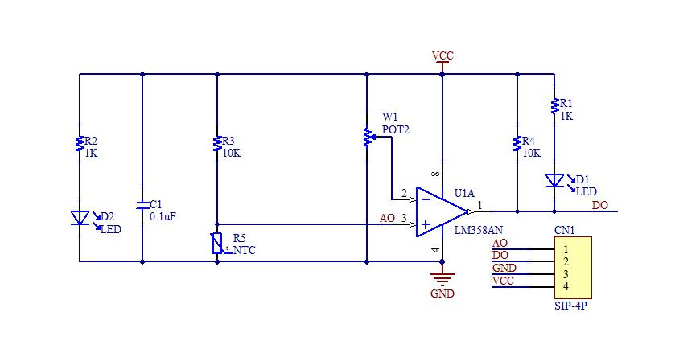
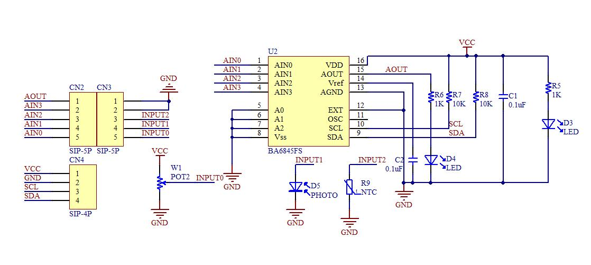
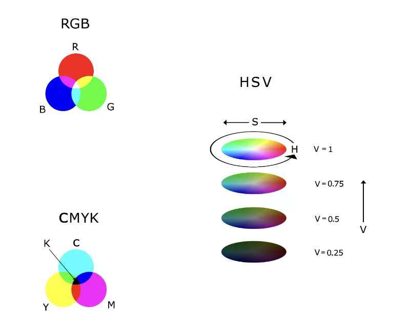

# smart-car
## Greenhouse Inspection Rover — “Measure. Monitor. Grow”

  

---

## Overview

The **Greenhouse Inspection Rover** is a mobile monitoring platform for routine greenhouse inspection, environmental sensing, and visual data collection. It integrates mobility, sensing, image capture, alert generation, and operator interaction into a single rover platform. The system is intended to help operators observe crop conditions more consistently, capture environmental variation across different positions, and support earlier responses to abnormal conditions.

More importantly, this project is not presented as a fully autonomous replacement for greenhouse labour. Instead, it explores how a low-cost robotic platform can restructure routine inspection into a more repeatable, traceable, and data-supported workflow. In that sense, the rover should be understood as a practical step from manual checking toward accessible smart-agriculture deployment.

## Project Story

Greenhouse management depends heavily on regular inspection. Operators must move through aisles, observe plant conditions, check environmental parameters, and respond to abnormal changes before crop quality is affected. In practice, however, this work is often repetitive, manual, and difficult to standardize. As the number of checkpoints, sensed parameters, and visual observations increases, maintaining consistency becomes more difficult and more time-consuming.

The **Greenhouse Inspection Rover** was developed in response to this challenge. The goal is not simply to build a small smart car with a few sensors, but to create a practical robotic platform for routine patrol, environmental sensing, and visual inspection inside greenhouse environments. By moving through aisles, collecting local measurements, and capturing plant images for review, the rover transforms inspection from an occasional manual task into a more structured engineering workflow.

This project is based on an important observation: greenhouse problems rarely appear all at once. Small local changes in temperature, humidity, or light can gradually influence plant growth, while early signs of stress may first appear through leaf colour change, fruit appearance, or growth inconsistency. Fixed monitoring points are useful, but they mainly reflect average conditions. A mobile rover, by contrast, can gather data closer to where plants actually grow and can build image records across multiple positions.

From this perspective, the rover should not be understood as an isolated hardware prototype. Its practical value depends on whether different subsystems can work together reliably: movement through greenhouse aisles, environmental sensing, image capture, threshold-based alerts, data logging, and operator control. Each module is useful on its own, but the real engineering challenge is system coordination. A rover with sensors, a camera, and motors is not automatically a deployable inspection system; it becomes useful only when those components can operate together in a stable and repeatable mission process.

This also explains the realistic scope of the project. The rover does not claim to fully automate greenhouse management or replace growers’ judgment. Instead, it focuses on reducing repetitive manual workload, improving inspection consistency, and supporting earlier intervention through better data collection and review. In other words, its value lies in **workflow enhancement**, not immediate labour substitution.

Like many emerging robotic systems, the rover is best understood as part of a gradual deployment path. Early value is most likely to appear in structured, repetitive, and easy-to-evaluate inspection tasks, rather than in completely open-ended agricultural autonomy. For that reason, this project emphasizes practical patrol, logging, and early warning first, while treating more advanced intelligence and closed-loop automation as future extensions.

In short, the goal of this project is clear:

**Measure. Monitor. Grow.**

## Why It Matters

The importance of the **Greenhouse Inspection Rover** lies not in any single technical feature, but in the way it connects sensing, visual inspection, mobility, and operator interaction into one inspection workflow.

- It reduces repetitive manual patrol effort.
- It improves consistency through repeatable patrol and logging procedures.
- It helps identify local abnormal conditions earlier.
- It creates timestamped records for comparison, reporting, and later review.
- It provides a practical foundation for future smart-agriculture expansion.

Most importantly, the project reflects a realistic deployment logic: meaningful impact is more likely to emerge through gradual improvement of structured inspection tasks than through immediate full autonomy. The rover therefore serves as a mobile assistant for greenhouse operators, supporting better monitoring rather than replacing human decision-making.

---

## Key Objectives
- **Environmental Monitoring:** Collect temperature, humidity, and light measurements across different greenhouse locations.
- **Visual Inspection:** Use an onboard camera to capture plant images for routine checks and progress tracking.
- **Early Warning:** Detect abnormal conditions and generate alerts (threshold-based and trend-based) to support timely intervention.
- **Data Logging & Traceability:** Store sensor readings and images with timestamps and optional location tags for later review and reporting.
- **Safe Operation:** Ensure reliable movement in narrow aisles with basic obstacle handling, emergency stop, and fail-safe stop on errors.
- **Ease of Use:** Provide a simple workflow for operators: start patrol → monitor → review results → export report.

---

## System Photos / CAD Renders

This section presents visual documentation of the rover, including real prototype photos. These figures help reviewers understand the mechanical structure, sensor placement, wiring layout, and overall system arrangement.

   
  <em>Figure 1. Rover Prototype (Photo): Side view of the greenhouse inspection rover.</em>

   
  <em>Figure 2. Rover Top View (Photo): Top view showing the controller board, wiring, and sensor layout.</em>

   
  <em>Figure 3. Rover Additional View (Photo): Another angle of the rover showing structural details.</em>

---

## Table of Contents
- [Bill of Materials (BOM)](#bill-of-materials-bom)
- [System Functional Requirements](#system-functional-requirements)
- [Extended Features](#extended-features)
- [User Workflow and Operating Modes](#user-workflow-and-operating-modes)
- [Software Architecture](#software-architecture)
- [Repository Structure and Key Classes / Modules](#repository-structure-and-key-classes--modules)
- [User Case UML / Sequence Diagram](#user-case-uml--sequence-diagram)
- [Circuit / Wiring Diagram](#circuit--wiring-diagram)
- [Data Logging, Alerts and Reporting](#data-logging-alerts-and-reporting)
- [Latency and Performance Notes](#latency-and-performance-notes)
- [Validation and Test Plan](#validation-and-test-plan)
- [Risk Assessment and Safety Features](#risk-assessment-and-safety-features)
- [Acknowledgements](#acknowledgements)
- [Authors and Contributions](#authors-and-contributions)
- [License (Third-Party Libraries)](#license-third-party-libraries)
- [Future Work](#future-work)
- [Contact Us](#contact-us)
- [Last Updated](#last-updated)

---

## Bill of Materials (BOM)

This section lists the main hardware modules used in the **Greenhouse Inspection Rover**.

#### **Raspberry Pi 4 Model B (4GB recommended)**

Acts as the main controller for sensing, image capture, logging, and higher-level task coordination.

#### **Motor Expansion Board**
[Schematic PDF](schematics/motor_expansion_board_schematic_v3.pdf)

Provides motor driving capability for rover movement and low-level motion control.

#### **Sensor Kit**

Includes environmental sensing and auxiliary modules used for routine inspection tasks.

#### **Analog Temperature Sensor Module**

Used for local temperature measurement and threshold-based monitoring.

#### **PCF8591 ADC/DAC Module**

Provides analog-to-digital conversion for analog sensor input and enables flexible sensor integration.

#### **Active Buzzer**

Used for audible alerts during abnormal conditions or fault events.

#### **Joystick Module**

Supports manual interaction and debugging during teleoperation or bench testing.

#### **RGB LED Module**

Provides simple visual state indication such as normal, warning, or fault status.

#### **T-Type GPIO Expansion Board (T-Cobbler)**

Simplifies prototyping and wiring between the Raspberry Pi and peripheral modules.

#### **IR Line Tracking Module**

Supports basic line-following behaviour for structured patrol paths.

#### **IR Receiver + IR Remote Controller**

Enables remote manual control for targeted inspection and testing.

#### **USB Camera + Pan-Tilt Servo Gimbal**

Provides visual inspection capability and adjustable camera orientation for targeted observation.

Fruit Color Recognition (Target: Red). This figure shows the colour-model diagram used for basic colour-based visual analysis.

#### **Breadboard**

Used for temporary wiring, testing, and modular integration during development.

#### **Voltmeter Module**

Used for battery or power monitoring to support low-voltage warning and safer operation.

---

## System Functional Requirements

The greenhouse inspection rover shall provide the following functional capabilities to support routine patrol, data collection, and operator decision-making.

### Environmental Sensing
- The system shall measure temperature, humidity, and light intensity at configurable intervals (time-based or distance-based).
- The system shall support sensor calibration offsets and basic filtering (e.g., moving average) to reduce noise.
- The system shall detect invalid readings (out-of-range / disconnected sensor) and log a fault event.

### Visual Inspection (Camera)
- The system shall capture still images of plants at configurable intervals and store them with timestamps.
- The system shall support event-triggered image capture, for example when an environmental parameter exceeds a threshold.
- The system shall allow the operator to manually trigger image capture during teleoperation.

### Patrol and Movement
- The system shall provide a manual control mode (teleoperation) for testing and targeted inspection.
- The system shall provide a patrol mode that moves along greenhouse aisles and stops at sampling points.
- The system shall implement basic obstacle handling: stop, wait, and/or reroute depending on available sensors.

### Data Logging and Reporting
- The system shall log sensor readings and mission metadata into a local file or database (e.g., CSV/SQLite).
- The system shall store captured images with consistent naming (timestamp + optional location tag).
- The system shall generate a mission summary including min/avg/max values, alert counts, and image references.

### Alerts and Thresholds
- The system shall support configurable threshold-based alerts for temperature, humidity, and light.
- The system shall support trend-based alerts (e.g., temperature rising continuously for N minutes).
- The system shall record all alerts with timestamps and associated sensor values.

### Safety and Fail-Safe Behavior
- The system shall include an emergency stop function (hardware button or software command).
- The rover shall automatically stop the motors when critical faults occur (sensor failure, low battery, or loss of control signal).
- The system shall monitor battery voltage and provide a low-battery warning and safe stop/return behaviour.

### Usability
- The system shall provide a simple workflow: start mission → monitor status → review logs/images → export report.
- The system shall provide clear status indication (LED/buzzer/on-screen messages) for states such as running, alert, and error.

---

## Extended Features

To make the greenhouse inspection rover more practical and closer to a complete smart-agriculture system, the following extended features are proposed. These features are modular and can be implemented in phases.

### Multi-Point Patrol & Location Tagging
- Route-based patrol missions: define aisles and checkpoints, and stop automatically for sampling.
- Distance/time-triggered sampling: record readings every N seconds or every M metres.
- Location tagging: associate each record with an aisle ID (e.g., A1–A10) and checkpoint ID.

### Smart Alerts and Event Handling
- Threshold alerts: configurable upper/lower limits for temperature, humidity, and light.
- Trend alerts: detect continuous rise/fall over a time window to provide earlier warning.
- Event actions: when an alert occurs, the rover can pause, take close-up photos, and mark an event in the log.

### Plant Growth Tracking with Vision (Optional)
- Scheduled photo capture at fixed locations for long-term comparison.
- Simple visual metrics (rule-based):
  - greenness index / colour shift (early yellowing detection)
  - estimated leaf area change
  - suspicious spot / high-contrast area detection for disease hints
- Before–after comparison: “today vs. last week” quick review at the same checkpoint.

### Closed-Loop Environmental Actuation (Optional)
Add relay-controlled devices to form a basic closed-loop system:
- fan / ventilation
- humidifier (mist)
- supplemental lighting

Example policy table (if–then rules):
- humidity below threshold → mist for 10 s → wait 2 min → re-check
- light below threshold during daytime → enable LED strip for X minutes

### Remote Dashboard & Operator Interface
- Local web dashboard hosted on the Pi:
  - real-time sensor values, alert list, mission status
  - latest captured images (gallery)
  - export CSV/report button
- Mobile-friendly control panel:
  - start/stop patrol, return home, manual capture, emergency stop

### Reliability and Safety Enhancements
- Battery monitoring with low-battery warning and safe return/stop.
- Watchdog and fail-safe stop if the control loop hangs or communication is lost.
- Obstacle avoidance using ultrasonic/ToF sensors, with stop or reroute logic.

### Deployment Roadmap
Because practical robotic impact is usually phased rather than immediate, the rover’s development path is also designed as a gradual roadmap:
- **Phase 1:** manual control + sensing + basic logging
- **Phase 2:** structured patrol + event-triggered capture + threshold alerts
- **Phase 3:** dashboard + multi-point patrol + richer reporting
- **Phase 4:** optional closed-loop environmental response and higher-level vision analysis

This phased approach reflects the idea that useful deployment should begin with structured, low-risk, and economically clear tasks before moving toward more complex autonomy.

---

## User Workflow and Operating Modes

This section describes how an operator interacts with the greenhouse inspection rover and how the rover behaves under different operating modes. The design focuses on a simple workflow with clear state transitions and safe stopping behaviour.

### Typical User Workflow
1. **Power On & Setup:** The operator powers on the rover, confirms battery level, and checks that the sensors and camera are detected.
2. **Select Mode:** Choose one of the operating modes: Manual Inspection, Patrol Mission, or Data Review.
3. **Start Mission:** The rover begins moving (or waits for teleoperation commands). Sensor sampling and logging start automatically.
4. **Monitoring During Operation:** The operator observes live sensor values and camera preview (optional). Alerts are displayed if thresholds or trends are exceeded.
5. **Event Handling (If Any Alert Occurs):** The rover pauses (optional), captures extra close-up images, and records an event marker in the log.
6. **Mission End:** The rover stops at the end of the route or returns to the start point (optional).
7. **Review & Export:** The operator reviews the mission summary, images, and exports CSV/report files for greenhouse management records.

### Operating Modes
- **Mode A — Manual Inspection (Teleoperation)**  
  Purpose: debugging, targeted inspection, and close-up image capture.  
  Features enabled: manual drive, manual photo capture, live sensor readout.

- **Mode B — Patrol Mission (Semi/Auto)**  
  Purpose: routine scheduled patrol along greenhouse aisles.  
  Features enabled: autonomous sampling, event-triggered capture, alert generation, summary report.

- **Mode C — Stationary Monitoring (Optional)**  
  Purpose: use the rover as a temporary monitoring station.  
  Features enabled: high-frequency sensing, trend alerts, periodic photo capture.

- **Mode D — Data Review / Maintenance**  
  Purpose: maintenance and dataset management.  
  Functions: view logs/images, clean storage, calibration offsets, sensor diagnostics.

**State Machine (Recommended):**  
Idle → Self-check → Manual / Patrol / Stationary → Alert-handling → Return / Stop → Report

Safety rule: any critical fault triggers Safe Stop and requires operator confirmation before resuming.

---

## Software Architecture

The greenhouse inspection rover software is designed as a modular system so that sensing, movement, vision, logging, and alert handling can evolve together without becoming tightly coupled. This reflects the central engineering idea behind the project: practical capability depends not only on the existence of modules, but on whether they can coordinate reliably in real inspection tasks.

### High-Level Architecture
Core modules:
- **Mission Manager (State Machine / FSM):** Controls overall rover states and mission flow (Idle → Self-check → Patrol → Alert-handling → Return → Report).
- **Sensor Manager:** Reads temperature/humidity/light (and optional sensors) at a fixed rate, applies filtering, and publishes data.
- **Vision Module:** Handles camera capture, file naming, storage, and optional CV inference.
- **Motion Control Module:** Provides low-level motor control and high-level motion primitives (forward/stop/turn).
- **Navigation Module:** Implements patrol behaviour (checkpoints, obstacle stop/avoid, return-to-home).
- **Alert Manager:** Evaluates thresholds/trends and triggers alerts and event actions (pause + extra photos).
- **Data Logger:** Writes sensor data, events, and mission metadata into CSV/SQLite; manages image indexing.
- **UI / Dashboard:** CLI or local web interface for controlling missions and reviewing results.

### Data Flow
- Sensors produce periodic readings → Sensor Manager
- Readings are filtered and timestamped → sent to Logger + Alert Manager
- Alert Manager may trigger event actions (pause + photo) via Mission Manager
- Vision Module stores images and returns file references → stored by Logger
- At mission end, the Report Generator summarizes statistics and exports outputs

### Concurrency Model (Recommended)
- Thread/Task 1: Sensor sampling (typically 1–5 Hz)
- Thread/Task 2: Motion & navigation loop (50–100 Hz control loop; obstacle checks 5–20 Hz)
- Thread/Task 3: Camera capture (periodic or event-driven)
- Thread/Task 4: UI / communication (web server, remote control, status updates)

This separation prevents camera or disk I/O from blocking motor safety control.

### Key Design Principles
- **Loose coupling:** Modules communicate through well-defined interfaces or message queues.
- **Fail-safe first:** Any critical fault triggers Safe Stop in the Mission Manager.
- **Configuration-driven:** Thresholds, sampling rates, and route checkpoints are stored in config files (YAML/JSON).
- **Testability:** Sensor stubs and simulated inputs enable unit testing without hardware.
- **Phased deployability:** Structured, low-risk functions are prioritized before more complex autonomous behaviours.

---

## Repository Structure and Key Classes / Modules

The repository is organised to separate documentation assets, hardware references, and implementation code.

- `images/` — project images, logo, rover photos, and visual illustrations used in the README
- `include/` — header files and interface definitions for C/C++ modules
- `schematics/` — wiring diagrams, module schematics, and hardware reference files
- `src/` — main source code for sensing, motion, patrol logic, logging, and control
- `tests/` — test programs or validation scripts for individual modules
- `CMakeLists.txt` — project build configuration
- `README.md` — project overview, documentation, and system description

Recommended logical module grouping inside `src/` / `include/`:
- sensing module
- motion control module
- patrol/navigation module
- alert and event module
- camera / image capture module
- data logging module
- UI / remote-control module

This structure supports modular development and makes it easier to extend the rover from a prototype into a more complete inspection platform.

---

## User Case UML / Sequence Diagram

This section describes the main user cases and the corresponding sequence of interactions between the operator and the rover subsystems. The diagrams clarify responsibilities across sensing, motion, vision, logging, and alert handling.

### Main User Cases (Use Case List)
- **Start Patrol Mission**  
  Actor: Operator  
  Goal: Start an inspection mission and collect data/images automatically.

- **Manual Inspection & Photo Capture**  
  Actor: Operator  
  Goal: Teleoperate the rover to a target plant and capture close-up images.

- **Alert Event Handling**  
  Actor: Rover (system) + Operator  
  Goal: Detect abnormal environmental conditions, capture evidence, and notify the operator.

- **End Mission & Export Report**  
  Actor: Operator  
  Goal: Stop the mission, review results, and export logs/images for record keeping.

### Sequence Diagram — Patrol Mission (UC-1)
Participants: Operator, UI/Dashboard, MissionManager, SensorManager, AlertManager, CameraModule, DataLogger, MotorControl, ObstacleSensor (optional)

Sequence (text form):
- Operator → UI: Select Patrol Mode and press Start.
- UI → MissionManager: `startMission(patrol)`
- MissionManager → SelfCheck: battery/sensor/camera status verification
- MissionManager → MotorControl: `beginPatrol()`
- Loop (while patrol is running):
  - SensorManager → DataLogger: `log(sensor_readings, timestamp, location)`
  - SensorManager → AlertManager: `evaluate(readings)`
  - AlertManager → MissionManager: if abnormal → `triggerEvent(alertType)`
  - MissionManager → CameraModule: `captureImage(eventTag)`
  - CameraModule → DataLogger: `log(image_path, timestamp, location, eventTag)`
  - ObstacleSensor → Navigation/MotorControl: if obstacle → `stop()` / `wait()` / `reroute()`
- Operator → UI: Press Stop (or route ends).
- UI → MissionManager: `stopMission()`
- MissionManager → DataLogger: `finalizeMission()`
- DataLogger → ReportGenerator: `generateSummary()`
- UI → Operator: Display summary + provide export.

_TODO: Insert UML sequence diagram figure (Mermaid or image)._

---

## Circuit / Wiring Diagram

This section should summarize how sensing, control, actuation, and alert modules are wired to the Raspberry Pi and motor-control hardware.

Recommended contents:
- GPIO mapping table
- power distribution path
- motor driver connections
- sensor input connections (digital / analog via PCF8591)
- buzzer / LED status outputs
- camera and pan-tilt servo connection overview

Current reference schematics are provided in the `schematics/` folder. A future revision of this README can include a consolidated system-level wiring figure for faster reproduction.

---

## Data Logging, Alerts and Reporting

The rover is intended to support traceable inspection rather than one-time observation. For that reason, logging and reporting are treated as core system functions.

### Suggested Logged Data
- timestamp
- mission ID
- optional checkpoint / aisle ID
- temperature / humidity / light readings
- alert type and threshold status
- image filename or path
- battery level / low-voltage event
- operator mode and mission state

### Suggested Storage Formats
- **CSV:** simple, portable, and easy to inspect manually
- **SQLite:** better for larger missions, structured queries, and long-term record management

### Alert Records
Each alert entry should include:
- timestamp
- alert category
- measured value
- threshold or trend condition
- rover state at the time of alert
- whether an extra image was captured

### Report Output
A mission report may include:
- mission duration
- number of checkpoints visited
- min/avg/max values for each sensed parameter
- number and type of alerts
- list of captured images
- brief operator notes if supported

This reporting structure helps turn patrol activity into a reviewable management record.

---

## Latency and Performance Notes

The rover is not intended for high-speed autonomous navigation. Its performance target is stable inspection rather than aggressive motion.

Recommended operating assumptions:
- sensor sampling: 1–5 Hz
- obstacle checking: 5–20 Hz
- motion control loop: 50–100 Hz
- image capture: periodic or event-triggered
- logging: asynchronous where possible to avoid blocking motion control

Design considerations:
- motor safety control should always have higher priority than image storage
- camera and file I/O should not freeze the patrol loop
- alert detection should be lightweight enough to run during normal inspection
- sampling frequency should be matched to rover speed and greenhouse layout

The practical target is not maximum computational throughput, but stable, low-risk patrol performance under repeated operation.

---

## Validation and Test Plan

The rover should be validated in stages, from individual modules to full patrol missions.

### Module-Level Tests
- sensor reading accuracy and repeatability
- motor forward/stop/turn behaviour
- line-tracking response
- buzzer / LED alert output
- camera capture and file saving
- battery-voltage monitoring

### Integration Tests
- simultaneous sensing + movement + logging
- event-triggered image capture during patrol
- remote manual override during semi-auto operation
- alert generation under threshold violations
- safe stop behaviour under simulated faults

### Scenario Tests
- routine greenhouse patrol along a fixed route
- checkpoint-based data capture
- manual close-up inspection of a selected plant
- abnormal-condition handling (e.g., sensor threshold exceeded)
- low-battery warning and controlled stop

### Success Criteria
- data and image timestamps are recorded correctly
- no critical module blocks the safety stop path
- patrol missions can be repeated with consistent results
- logs are readable and usable for post-mission review

---

## Risk Assessment and Safety Features

As a mobile robotic platform operating near plants, wiring, and operators, the rover should prioritise safe and predictable behaviour.

### Key Risks
- collision with greenhouse structures or plants
- sensor failure or invalid readings
- low battery during patrol
- software freeze or communication loss
- false alerts or missed alerts
- cable looseness or unstable hardware mounting

### Mitigation Features
- emergency stop function
- fail-safe motor stop on critical error
- battery-voltage monitoring and warning
- watchdog or timeout for control-loop failure
- threshold validation and fault logging for abnormal sensor values
- modular wiring and documented schematics for easier troubleshooting

### Safety Principle
If the system is uncertain, it should prefer to stop safely rather than continue moving.

This principle aligns with the project’s broader design logic: stable and low-risk deployment is more important than demonstrating maximum autonomy.

---

## Acknowledgements

This project was developed as a multidisciplinary student engineering effort combining embedded systems, sensing, motion control, and robotics documentation. The team acknowledges the use of Raspberry Pi-based prototyping tools, open hardware modules, and publicly available robotics development resources that supported rapid implementation and testing.

---

## Authors and Contributions

- **Huichuan Zheng** — Overall project planning, code integration/merging, and main program implementation.
- **Rui Wang** — Motor driving module, IR remote configuration, and program implementation.
- **Yukun Shi** — Temperature-sensor intelligent control system configuration and programming, plus IR line-tracking implementation.
- **Xinge Rao** — README documentation and camera configuration.

---

## License (Third-Party Libraries)

This repository may depend on third-party libraries, drivers, and hardware support packages. Please review the license terms of any external code, Python packages, C/C++ libraries, or vendor schematics used in the project before redistribution.

_Recommended follow-up: list specific libraries and their licenses here._

---

## Future Work

Future development should follow a phased and practical roadmap rather than aiming for unrealistic full autonomy in a single step.

Potential next steps include:
- improved obstacle avoidance with ultrasonic or ToF sensors
- richer checkpoint-based patrol logic
- long-term image comparison for plant growth tracking
- a local dashboard for live status and mission review
- more robust event handling and trend-based analytics
- optional closed-loop environmental actuation
- more reliable hardware packaging for field deployment

In line with the project story, the most meaningful future progress will come from improving **integration reliability**, **repeatability**, and **deployment readiness**.

---

## Contact Us

For project discussion, repository issues, or collaboration inquiries, please use the GitHub repository issue page or contact the project contributors through their university/project communication channels.

_Recommended follow-up: replace this section with official email addresses if needed._

---

## Last Updated
2026-03-23